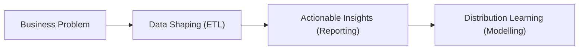
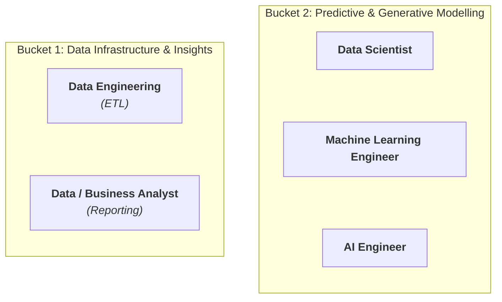
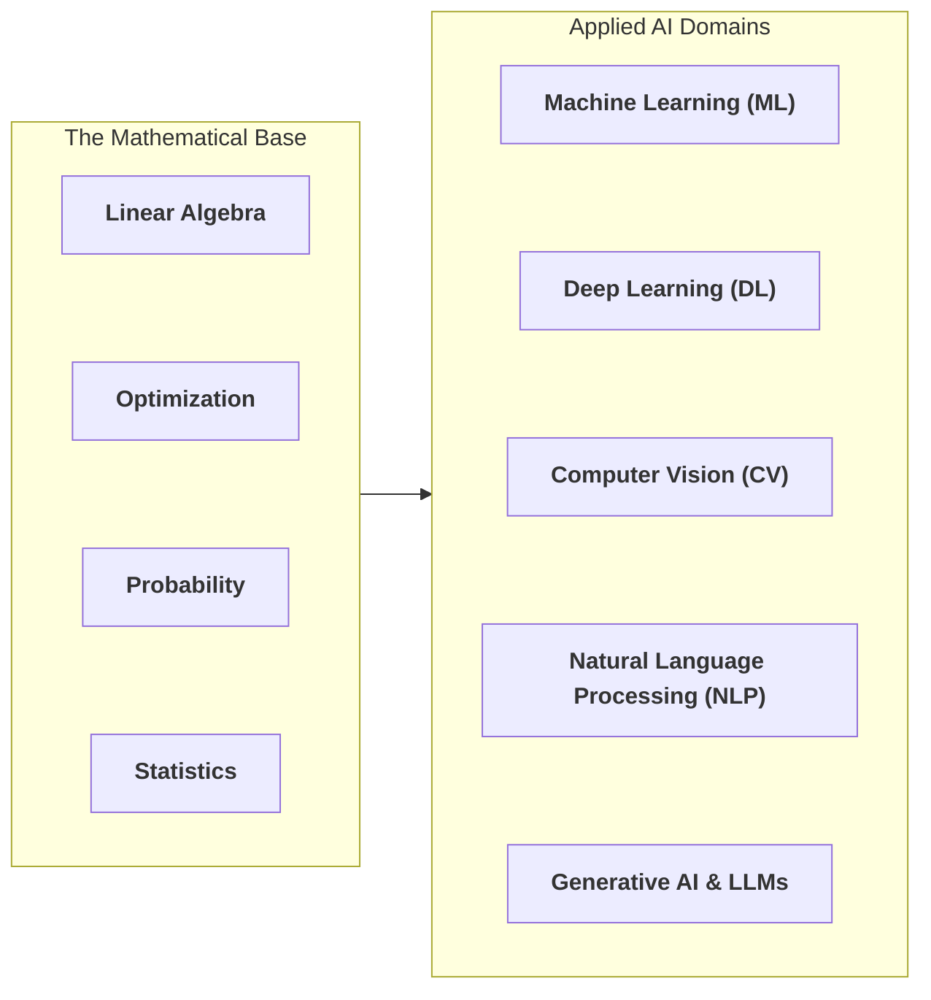
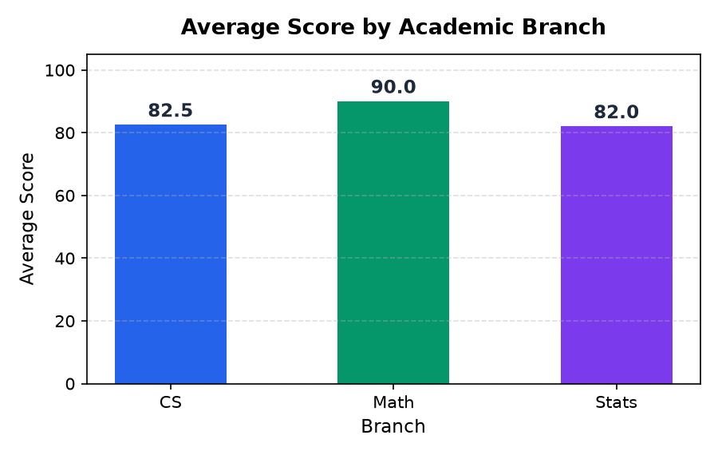

# How to Crack Data Science Jobs for Math Students?

> **Audience:** MSc Mathematics Students (1st & 2nd Year)  
> **Core Theme:** Why your mathematical foundation is your biggest unfair advantage in the AI & Data industry.

---

## 1. The Opening Question

```
"Why is an MSc in Mathematics highly relevant to the Data Industry?"
```
*The answer becomes obvious once we see how modern industry data problems actually work.*

---

## 2. The Real-World Data Lifecycle

Every data initiative in the industry moves through four core stages:

<div align="center">



</div>

1. **Business Problem Statement**
   - Defining objectives, metrics, and business questions.
2. **Collect & Shape Data (ETL)**
   - Gathering, cleaning, transforming, and structuring raw data.
3. **Visualize & Report (Actionable Insights)**
   - Dashboards, exploratory analysis, and business intelligence.
4. **Predict & Optimize (Modelling)**
   - Learning the underlying data distribution to predict the future (ML / DL / CV / NLP / GenAI).

---

## 3. The Two Broad Job Categories

<div align="center">



</div>

| Job Category | Focus Areas | Primary Target Roles |
| :--- | :--- | :--- |
| **ETL & Reporting** | Data pipelines, warehousing, SQL, KPI dashboards, business metrics | • Data Engineer<br>• Data Analyst<br>• Business Analyst |
| **Modelling** | Statistical learning, distribution approximation, deep architectures, fine-tuning | • Data Scientist<br>• Machine Learning Engineer<br>• AI Engineer |

---

## 4. Inside Modelling: The Mathematical Core

Modelling is simply applied mathematics at scale.

<div align="center">



</div>

### The Direct Mapping

- **Linear Algebra** $\rightarrow$ Vectors, matrices, eigenvalues/eigenvectors, SVD, vector embeddings, dimensionality reduction (PCA).
- **Optimization** $\rightarrow$ Convex optimization, gradient descent, loss function landscapes, backpropagation.
- **Probability** $\rightarrow$ Random variables, probability distributions (Gaussian, Bernoulli, Poisson), Central Limit Theorem (CLT), Bayes' Theorem, expectation & variance.
- **Statistics** $\rightarrow$ Descriptive Statistics (measures of central tendency, variance, skewness) & Inferential Statistics (hypothesis testing, p-values, confidence intervals, Maximum Likelihood Estimation).

---

## 5. The Core Realization: Math is the Engine, Code is the Vehicle

> **1. Mathematics is your biggest unfair advantage.**  
> You already understand distributions, optimization surfaces, and matrix transformations that others struggle with for years.
> 
> **2. But Math alone is not sufficient in industry.**  
> Companies don't hire you to write proofs on a blackboard — they hire you to build reliable pipelines, train models, and deploy solutions that generate revenue.
> 
> **3. The Next Step:**  
> To turn your mathematical strengths into job offers, you must bridge theory to execution using the **industry technology stack**.

---

## 6. The Bridge: Role-by-Role Technology Stack

> The exact tools and frameworks needed to translate mathematical thinking into production systems:

### 6.1 Data Engineering (DE)
* **Mandate:** Building scalable data pipelines, data warehouses, and ETL systems.
* **Languages:** `SQL` *(Advanced)*, `Python`
* **Data Processing:** `Apache Spark / PySpark`
* **Databases (RDBMS & NoSQL):** `PostgreSQL`, `MySQL`, `MongoDB`, `Redis`
* **Cloud Warehouses & Lakes:** `Snowflake`, `Google BigQuery`, `Databricks`
* **Orchestration & Infra:** `Airflow`, `Docker`, `Linux / Bash`

### 6.2 Data / Business Analyst (DA / BA)
* **Mandate:** Translating raw business data into KPIs, dashboards, and actionable decisions.
* **Languages:** `SQL`, `Python`
* **Libraries:** `Pandas`, `Matplotlib`, `Seaborn`
* **BI & Reporting:** `Power BI`, `Tableau`, `Looker`, `Excel`
* **IDEs & Workbenches:** `Jupyter Notebooks`, `DBeaver / SQL Workbenches`

### 6.3 Data Scientist (DS)
* **Mandate:** Statistical experimentation, hypothesis testing, feature engineering, and predictive modelling.
* **Languages:** `Python`, `SQL`
* **Libraries & Frameworks:** `NumPy`, `Pandas`, `SciPy`, `Statsmodels`, `Scikit-Learn`
* **IDEs & Environment:** `Jupyter Notebooks / JupyterLab`, `Google Colab`, `VS Code`

### 6.4 Machine Learning Engineer (MLE)
* **Mandate:** Designing, scaling, and deploying production machine learning and deep learning systems.
* **Languages:** `Python`, `SQL`
* **Libraries & Frameworks:** `PyTorch`, `TensorFlow`, `Scikit-Learn`, `XGBoost`, `LightGBM`, `OpenCV`
* **IDEs & Infrastructure:** `VS Code`, `Docker`, `FastAPI`, `MLflow` / `Weights & Biases`, `Kubernetes`

### 6.5 AI Engineer (AIE)
* **Mandate:** Building intelligent systems leveraging Foundation Models, LLMs, and Generative AI.
* **Languages:** `Python`
* **Frameworks & SDKs:** `Hugging Face Transformers`, `LangChain`, `LlamaIndex`, `OpenAI / Anthropic SDKs`
* **Vector Storage:** `Pinecone`, `Chroma`, `Qdrant`
* **IDEs & Serving Infra:** `VS Code`, `vLLM`, `Ollama`, `Docker`, `FastAPI`

---

## 7. How to Learn: The Two Types of Courses

In the market, data science education splits into two distinct categories:
1. **Math & Foundations Courses** (Theory, proofs, mechanics)
2. **API Calling Courses** (Syntax, library functions, tool usage)

---

### 7.1 The Problem with Most "API Calling" Courses

Most API-focused tutorials fail because they encourage **rote memorization**:
- They show disconnected code snippets and list standard functions.
- They do not teach the underlying mental model of how libraries are designed.
- **Industry Reality:** No company rewards memorizing syntax. Industry rewards problem-solving and navigating documentation to build working systems.

---

### 7.2 The API Mastery Framework: Stitched End-to-End Walkthrough

Instead of memorizing functions, learn how to trace: **Data Structure $\rightarrow$ Method Execution $\rightarrow$ Inputs/Outputs $\rightarrow$ Official API Documentation**.

---

#### Cell [1]: Data Ingestion & Structure Initialization

```python
import pandas as pd
import numpy as np
import matplotlib.pyplot as plt

# Cooked-up dataset: Student performance across academic branches
raw_data = {
    "student_id": [101, 102, 103, 104, 105, 106],
    "branch": ["Math", "Math", "Stats", "Stats", "CS", "CS"],
    "score": [88, 92, 79, 85, 95, 70],
    "hours_studied": [12, 15, 8, 10, 18, 6]
}

df = pd.DataFrame(raw_data)
df
```

**Output:**
```text
   student_id branch  score  hours_studied
0         101   Math     88             12
1         102   Math     92             15
2         103  Stats     79              8
3         104  Stats     85             10
4         105     CS     95             18
5         106     CS     70              6
```

| API Breakdown | Specification |
| :--- | :--- |
| **API Used** | `pandas.DataFrame(data=...)` |
| **Input & Type** | `raw_data` (`dict[str, list]`) |
| **Output & Type** | `df` (`pandas.core.frame.DataFrame`) |
| **Official Documentation** | [pandas.DataFrame Docs](https://pandas.pydata.org/docs/reference/api/pandas.DataFrame.html) |

---

#### Cell [2]: ETL & Grouped Aggregations

```python
# Group by branch and compute average score and total hours
branch_summary = (
    df.groupby("branch")
      .agg(avg_score=("score", "mean"), total_hours=("hours_studied", "sum"))
      .reset_index()
)
branch_summary
```

**Output:**
```text
  branch  avg_score  total_hours
0     CS       82.5           24
1   Math       90.0           27
2  Stats       82.0           18
```

| API Breakdown | Specification |
| :--- | :--- |
| **APIs Used** | `DataFrame.groupby()`, `DataFrameGroupBy.agg()`, `DataFrame.reset_index()` |
| **Input & Type** | `df` (`DataFrame`), `by="branch"` (`str`), named aggregations (`tuple[str, str]`) |
| **Output & Type** | `branch_summary` (`pandas.core.frame.DataFrame`) |
| **Official Documentation** | [DataFrame.groupby Docs](https://pandas.pydata.org/docs/reference/api/pandas.DataFrame.groupby.html) • [DataFrameGroupBy.agg Docs](https://pandas.pydata.org/docs/reference/api/pandas.core.groupby.DataFrameGroupBy.agg.html) • [DataFrame.reset_index Docs](https://pandas.pydata.org/docs/reference/api/pandas.DataFrame.reset_index.html) |

---

#### Cell [3]: Mathematical Feature Engineering (NumPy Vectorization)

```python
# Compute an intuitive metric: Score achieved per study hour invested
branch_summary["score_per_hour"] = np.round(
    branch_summary["avg_score"] / branch_summary["total_hours"], 2
)
branch_summary[["branch", "avg_score", "total_hours", "score_per_hour"]]
```

**Output:**
```text
  branch  avg_score  total_hours  score_per_hour
0     CS       82.5           24            3.44
1   Math       90.0           27            3.33
2  Stats       82.0           18            4.56
```

| API Breakdown | Specification |
| :--- | :--- |
| **API Used** | `numpy.round(a, decimals=2)` |
| **Input & Type** | Vectorized quotient (`Series` / array-like), `decimals` (`int`) |
| **Output & Type** | `branch_summary["score_per_hour"]` (`pandas.Series` of `float64`) |
| **Official Documentation** | [numpy.round Docs](https://numpy.org/doc/stable/reference/generated/numpy.round_.html) |

---

#### Cell [4]: Actionable Visual Charting

```python
# Plot comparison of average scores across branches
fig, ax = plt.subplots(figsize=(6, 3.8), dpi=150)
bars = ax.bar(branch_summary["branch"], branch_summary["avg_score"], color=["#2563eb", "#059669", "#7c3aed"], width=0.5)

ax.set_title("Average Score by Academic Branch", fontsize=13, fontweight="bold", pad=12)
ax.set_ylabel("Average Score", fontsize=11)
ax.set_xlabel("Branch", fontsize=11)
ax.set_ylim(0, 105)
ax.grid(axis="y", linestyle="--", alpha=0.4)

plt.tight_layout()
plt.show()
```

**Output:**

<div align="center">



</div>

| API Breakdown | Specification |
| :--- | :--- |
| **APIs Used** | `matplotlib.pyplot.subplots()`, `Axes.bar()`, `Axes.grid()`, `matplotlib.pyplot.show()` |
| **Input & Type** | `x`: branch names (`Series`), `height`: average scores (`Series`), `color`: list of hex codes |
| **Output & Type** | `fig` (`matplotlib.figure.Figure`), `ax` (`matplotlib.axes.Axes`) |
| **Official Documentation** | [matplotlib.pyplot.subplots Docs](https://matplotlib.org/stable/api/_as_gen/matplotlib.pyplot.subplots.html) • [Axes.bar Docs](https://matplotlib.org/stable/api/_as_gen/matplotlib.axes.Axes.bar.html) |

---

### 7.3 Recommended Resources

#### A. Mathematical & Theoretical Foundations

* **Linear Algebra:**
  * [Linear Algebra Through Geometry](https://www.youtube.com/watch?v=yzUWjbo049U&list=PLgMDNELGJ1CaTrBVbwaHoHYlTbyeV-q5c) — Prof. Arulalan Rajan (NPTEL / IISc Bengaluru, 63 Lectures)
* **Machine Learning Foundations:**
  * [Mathematical Foundations for Machine Learning](https://www.youtube.com/watch?v=Cvb-52mIoBU&list=PLgMDNELGJ1CYPJS6m_ygxb4KtHYxh1HjR) — Prof. Arulalan Rajan (NPTEL / IISc Bengaluru)
* **Deep Learning Theory:**
  * [Neural Networks and Deep Learning](http://neuralnetworksanddeeplearning.com/) — Michael Nielsen (Free Online Book)

#### B. Applied & Problem-Driven API Resources

* **Applied Machine Learning & End-to-End Workflows:**
  * [Hands-On Machine Learning with Scikit-Learn, Keras, and TensorFlow](https://books.google.co.in/books?id=HHetDwAAQBAJ) — Aurélien Géron (The gold standard textbook for end-to-end ML project workflows)
* **NLP & Transformer APIs:**
  * [Hugging Face NLP Course](https://huggingface.co/learn/nlp-course) — Free, production-grade guide to Transformer architectures, tokenizers, and pipelines
* **Agentic AI & Custom Tooling:**
  * [Antigravity Custom Agents & Skills](https://antigravity.google/blog/introducing-custom-agents) — Building agent workflows, custom slash commands, MCP servers, and executable agent skills
