# Pixels, Projections and Principal Components
### Linear Algebra at Work in Modern Image Processing

> **Audience:** MSc Big Data Analytics (BDA)  
> **Topic:** Linear Algebra at Work in Modern Image Processing

---

# Part 1: The Geometry of Projections

## 1.1 The Intuition: Projections as Shadows

Before looking at any formulas, imagine a physical setup:

A flashlight shines directly from above, perpendicular to a line or surface. An object or arrow floating in space casts a **shadow** onto that line or surface.

The **projection** is simply this shadow vector $\mathbf{p}$.

To construct any vector in physics or geometry, we only ever need two ingredients:
1. **Length:** How long is the shadow?
2. **Direction:** Which way does the shadow point?

$$\text{Projection Vector} = (\text{Length of Shadow}) \times (\text{Unit Direction})$$

---

## 1.2 Projecting a 2D Vector onto a 1D Line

Let $\mathbf{v}$ be a vector we want to project onto the line running along a direction vector $\mathbf{a}$.

<div align="center">

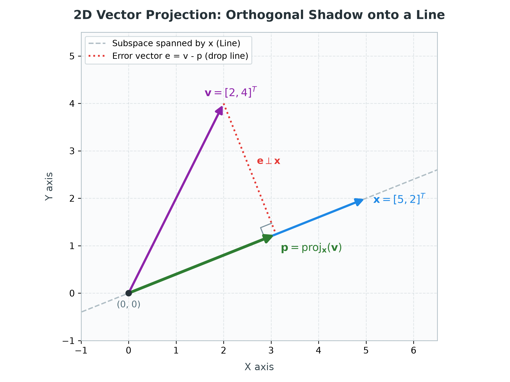

*Figure 1.2: Orthogonal projection of vector $\mathbf{v}$ onto direction vector $\mathbf{a}$, showing the perpendicular error line $\mathbf{e}$.*

👉 **[Open Interactive 2D Visualization in Browser](https://thisispk48.github.io/workshops/20260926_sju_26bda_pca/assets/1_2_fig_vector_projection.html)**

</div>

### Step A: Finding the Shadow Length

From basic right-triangle trigonometry:

$$\text{Shadow Length} = \|\mathbf{v}\| \cos(\theta)$$

Now recall the geometric definition of the **dot product**:

$$\mathbf{v} \cdot \mathbf{a} = \|\mathbf{v}\| \|\mathbf{a}\| \cos(\theta)$$

Notice that $\|\mathbf{v}\| \cos(\theta)$ is already sitting inside the dot product. The only extra term is $\|\mathbf{a}\|$. Therefore, dividing by the length of $\mathbf{a}$ isolates the exact shadow length:

$$\text{Shadow Length} = \frac{\mathbf{v} \cdot \mathbf{a}}{\|\mathbf{a}\|}$$

### Step B: Finding the Direction

The shadow lies on the line spanned by $\mathbf{a}$. To capture purely its direction without altering length, we normalize $\mathbf{a}$ into a **unit direction vector $\mathbf{u}$**:

$$\mathbf{u} = \frac{\mathbf{a}}{\|\mathbf{a}\|}$$

### Step C: Multiplying Length by Direction

Combine the two parts:

$$\mathbf{p} = \left( \frac{\mathbf{v} \cdot \mathbf{a}}{\|\mathbf{a}\|} \right) \left( \frac{\mathbf{a}}{\|\mathbf{a}\|} \right) = \left( \frac{\mathbf{v} \cdot \mathbf{a}}{\|\mathbf{a}\|^2} \right) \mathbf{a}$$

In matrix-vector notation (with column vectors, where $\mathbf{v} \cdot \mathbf{a} = \mathbf{a}^T \mathbf{v}$ and $\|\mathbf{a}\|^2 = \mathbf{a}^T \mathbf{a}$):

$$\mathbf{p} = \left( \frac{\mathbf{a}^T \mathbf{v}}{\mathbf{a}^T \mathbf{a}} \right) \mathbf{a}$$

---

### Step D: Deriving the 1D Projection Matrix $\mathbf{P}$

We want a single matrix $\mathbf{P}$ such that multiplying any vector $\mathbf{v}$ by $\mathbf{P}$ immediately gives its projection:

$$\mathbf{p} = \mathbf{P} \mathbf{v}$$

Notice that the scalar term $(\mathbf{a}^T \mathbf{v})$ can be commuted:

$$\mathbf{p} = \frac{\mathbf{a} (\mathbf{a}^T \mathbf{v})}{\mathbf{a}^T \mathbf{a}} = \left[ \frac{\mathbf{a} \mathbf{a}^T}{\mathbf{a}^T \mathbf{a}} \right] \mathbf{v}$$

We have successfully factored out $\mathbf{v}$ to the right! The term in the brackets is our **Projection Matrix**:

$$\mathbf{P} = \frac{\mathbf{a} \mathbf{a}^T}{\mathbf{a}^T \mathbf{a}}$$

#### Dimension Check:
- **Numerator ($\mathbf{a} \mathbf{a}^T$):** $(D \times 1) \times (1 \times D) = (D \times D)$ **Matrix** (Outer product).
- **Denominator ($\mathbf{a}^T \mathbf{a}$):** $(1 \times D) \times (D \times 1) = (1 \times 1)$ **Scalar** (Inner / Dot product).
- **Special Case (Unit Direction $\mathbf{u}$):** If $\mathbf{a}$ is already a unit vector $\mathbf{u}$ (with $\|\mathbf{u}\| = 1 \iff \mathbf{u}^T \mathbf{u} = 1$), the denominator equals $1$, simplifying to:

$$\mathbf{P} = \mathbf{u} \mathbf{u}^T$$

> **Crucial Forward Connection for Part 3:**  
> Remember the formula $\mathbf{P} = \mathbf{u}\mathbf{u}^T$. In Part 3, we will see that the optimal principal component directions are unit eigenvectors $\mathbf{q}_1, \mathbf{q}_2$, and compressing/reconstructing data onto them uses this exact rank-1 projection matrix $\mathbf{P} = \mathbf{q}_1 \mathbf{q}_1^T$!

---

### Example 1.2.1: Projecting $\mathbf{v} = [2, 4]^T$ onto the $45^\circ$ Diagonal Line

Let the direction line be $\mathbf{a} = \begin{bmatrix} 1 \\\\ 1 \end{bmatrix}$ (the $45^\circ$ diagonal line $y = x$).

1. **Outer product matrix ($\mathbf{a}\mathbf{a}^T$):**

$$\mathbf{a} \mathbf{a}^T = \begin{bmatrix} 1 \\\\ 1 \end{bmatrix} \begin{bmatrix} 1 & 1 \end{bmatrix} = \begin{bmatrix} 1 & 1 \\\\ 1 & 1 \end{bmatrix}$$

2. **Squared length ($\mathbf{a}^T\mathbf{a}$):**

$$\mathbf{a}^T \mathbf{a} = 1^2 + 1^2 = 2$$

3. **Projection Matrix $\mathbf{P}$:**

$$\mathbf{P} = \frac{1}{2} \begin{bmatrix} 1 & 1 \\\\ 1 & 1 \end{bmatrix} = \begin{bmatrix} 0.5 & 0.5 \\\\ 0.5 & 0.5 \end{bmatrix}$$

4. **Calculate the Shadow Vector $\mathbf{p}$:**

$$\mathbf{p} = \mathbf{P} \mathbf{v} = \begin{bmatrix} 0.5 & 0.5 \\\\ 0.5 & 0.5 \end{bmatrix} \begin{bmatrix} 2 \\\\ 4 \end{bmatrix} = \begin{bmatrix} 0.5(2) + 0.5(4) \\\\ 0.5(2) + 0.5(4) \end{bmatrix} = \begin{bmatrix} 3 \\\\ 3 \end{bmatrix}$$

5. **Calculate the Error Drop Line $\mathbf{e}$:**

$$\mathbf{e} = \mathbf{v} - \mathbf{p} = \begin{bmatrix} 2 \\\\ 4 \end{bmatrix} - \begin{bmatrix} 3 \\\\ 3 \end{bmatrix} = \begin{bmatrix} -1 \\\\ 1 \end{bmatrix}$$

6. **Orthogonality Check:**
   - **Dot product check:** $\mathbf{a}^T \mathbf{e} = (1)(-1) + (1)(1) = 0$.
   - **Slope check:** Line $y = x$ has slope $m_1 = +1$. The drop line $\mathbf{e}$ has slope $m_2 = \frac{1}{-1} = -1$. Because $m_1 \times m_2 = -1$, the drop hits at exactly $90^\circ$!

<div align="center">

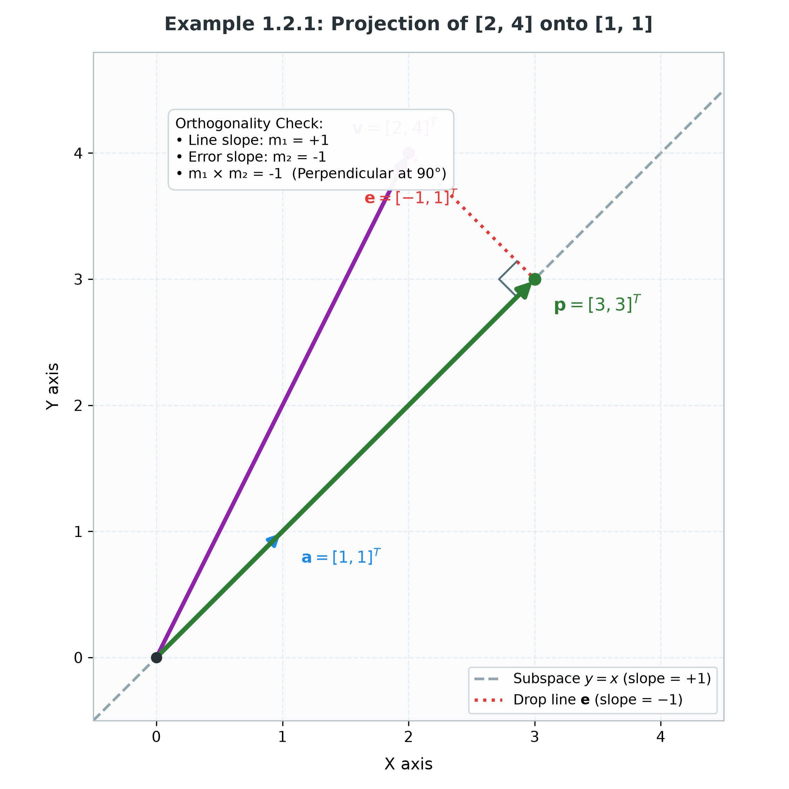

*Example 1.2.1: Orthogonal projection of $\mathbf{v} = [2, 4]^T$ onto direction $\mathbf{a} = [1, 1]^T$, yielding shadow $\mathbf{p} = [3, 3]^T$ and error $\mathbf{e} = [-1, 1]^T$.*

👉 **[Open Interactive Example 1.2.1 in Browser](https://thisispk48.github.io/workshops/20260926_sju_26bda_pca/assets/1_2_1_example_diagonal_projection.html)**

</div>

---

## 1.3 Abstracting Up: What Subspaces Can We Project Onto?

When we projected onto direction vector $\mathbf{a}$, we were really projecting onto the **1-dimensional subspace** (the infinite straight line) spanned by $\mathbf{a}$.

In any vector space, all valid linear subspaces must pass through the origin $(0, 0, \dots, 0)$.

### The Subspaces of 2D Space ($\mathbb{R}^2$):

| Dimension | Geometry | Description | Projection Matrix $\mathbf{P}$ |
| :--- | :--- | :--- | :--- |
| **0D** | **The Origin** | The single point $(0, 0)$ | $\mathbf{0}_{2 \times 2}$ (Zero Matrix) *(total loss of info)* |
| **1D** | **Any Line through Origin** | Line spanned by direction $\mathbf{a}$ (unit $\mathbf{u}$) | $\mathbf{P} = \frac{\mathbf{a}\mathbf{a}^T}{\mathbf{a}^T\mathbf{a}} = \mathbf{u}\mathbf{u}^T$ *(Rank 1 matrix)* |
| **2D** | **The Entire Plane** | The whole space $\mathbb{R}^2$ | $\mathbf{I}_{2 \times 2}$ (Identity Matrix) *(zero loss of info)* |

In 2D, the only non-trivial projection is onto a 1D line. To see how multiple directions work together, we must step up into **3D space**.

---

## 1.4 Projecting a 3D Vector onto a 2D Plane

Imagine a vector $\mathbf{b}$ floating in 3-dimensional space above a flat tabletop (a 2D plane passing through the origin). We want to find its shadow $\mathbf{p}$ on the tabletop.

<div align="center">

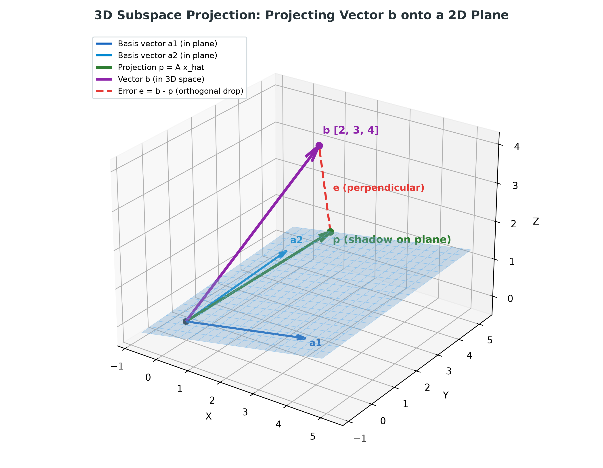

*Figure 1.4: Orthogonal projection of 3D vector $\mathbf{b}$ onto a 2D plane spanned by $\mathbf{a}_1$ and $\mathbf{a}_2$.*

👉 **[Open Interactive 3D Visualization in Browser](https://thisispk48.github.io/workshops/20260926_sju_26bda_pca/assets/1_4_fig_plane_projection_3d.html)** *(Rotate, zoom, and inspect in full 3D)*

</div>

### Fact 1: Any vector on the plane is a combination of basis vectors

A 2D plane requires **two linearly independent direction vectors**, $\mathbf{a}_1$ and $\mathbf{a}_2$. We stack them as columns of a matrix $\mathbf{A}$:

$$\mathbf{A} = \begin{bmatrix} \mathbf{a}_1 & \mathbf{a}_2 \end{bmatrix} \quad (\text{shape: } 3 \times 2)$$

Because the projection $\mathbf{p}$ lives on the plane, it must be some linear combination of the columns of $\mathbf{A}$:

$$\mathbf{p} = \hat{w}_1 \mathbf{a}_1 + \hat{w}_2 \mathbf{a}_2 = \mathbf{A} \mathbf{\hat{w}}$$

where $\mathbf{\hat{w}} = \begin{bmatrix} \hat{w}_1 \\\\ \hat{w}_2 \end{bmatrix}$ is the coordinate weight vector we must determine (representing how much of each basis direction makes up the shadow).

---

### Fact 2: The drop line (error vector) must hit at 90 degrees

The connection line from the tip of $\mathbf{b}$ down to the projection $\mathbf{p}$ is the **error vector** $\mathbf{e}$:

$$\mathbf{e} = \mathbf{b} - \mathbf{p} = \mathbf{b} - \mathbf{A} \mathbf{\hat{w}}$$

For $\mathbf{p}$ to be the closest point on the plane to $\mathbf{b}$, the drop line $\mathbf{e}$ must hit perpendicular ($90^\circ$) to the **entire plane**.

That means $\mathbf{e}$ must be orthogonal to **both** direction vectors spanning the plane:

$$\mathbf{a}_1 \cdot \mathbf{e} = 0 \implies \mathbf{a}_1^T \mathbf{e} = 0$$

$$\mathbf{a}_2 \cdot \mathbf{e} = 0 \implies \mathbf{a}_2^T \mathbf{e} = 0$$

Stack these two equations together:

$$\begin{bmatrix} \mathbf{a}_1^T \\\\ \mathbf{a}_2^T \end{bmatrix} \mathbf{e} = \begin{bmatrix} 0 \\\\ 0 \end{bmatrix}$$

Notice that the stacked matrix is simply $\mathbf{A}^T$! This yields the **fundamental orthogonality condition**:

$$\mathbf{A}^T \mathbf{e} = \mathbf{0}$$

---

### Fact 3: Solving for the weights $\mathbf{\hat{w}}$ (The Normal Equations)

Substitute $\mathbf{e} = \mathbf{b} - \mathbf{A} \mathbf{\hat{w}}$ into the orthogonality condition:

$$\mathbf{A}^T (\mathbf{b} - \mathbf{A} \mathbf{\hat{w}}) = \mathbf{0}$$

$$\mathbf{A}^T \mathbf{b} - \mathbf{A}^T \mathbf{A} \mathbf{\hat{w}} = \mathbf{0}$$

$$(\mathbf{A}^T \mathbf{A}) \mathbf{\hat{w}} = \mathbf{A}^T \mathbf{b}$$

Because the columns of $\mathbf{A}$ are linearly independent, the symmetric square matrix $(\mathbf{A}^T \mathbf{A})$ (size $2 \times 2$) is invertible. Multiply both sides by $(\mathbf{A}^T \mathbf{A})^{-1}$:

$$\mathbf{\hat{w}} = (\mathbf{A}^T \mathbf{A})^{-1} \mathbf{A}^T \mathbf{b}$$

---

### Fact 4: Extracting the Master Projection Matrix $\mathbf{P}$

Recall that the projection vector is $\mathbf{p} = \mathbf{A} \mathbf{\hat{w}}$. Substituting our solution for $\mathbf{\hat{w}}$:

$$\mathbf{p} = \mathbf{A} \left[ (\mathbf{A}^T \mathbf{A})^{-1} \mathbf{A}^T \mathbf{b} \right]$$

Grouping the matrices together:

$$\mathbf{p} = \left[ \mathbf{A} (\mathbf{A}^T \mathbf{A})^{-1} \mathbf{A}^T \right] \mathbf{b}$$

This reveals the **Master Projection Matrix Formula**:

$$\mathbf{P} = \mathbf{A} (\mathbf{A}^T \mathbf{A})^{-1} \mathbf{A}^T$$

#### Dimension Verification (in 3D):

$$\mathbf{P} = \underbrace{\mathbf{A}}_{3 \times 2} \, \underbrace{(\mathbf{A}^T \mathbf{A})^{-1}}_{2 \times 2} \, \underbrace{\mathbf{A}^T}_{2 \times 3} = (3 \times 3) \text{ Matrix}$$

Multiplying $(3 \times 3) \mathbf{P}$ by $(3 \times 1) \mathbf{b}$ yields the $(3 \times 1)$ projected vector $\mathbf{p}$.

---

### Special Case: Orthonormal Basis Vectors

If the directions spanning the subspace are chosen to be **mutually perpendicular and unit length** ($\mathbf{q}_1, \mathbf{q}_2$, forming matrix $\mathbf{Q}$), then:

$$\mathbf{Q}^T \mathbf{Q} = \mathbf{I}$$

The inverse term $(\mathbf{Q}^T \mathbf{Q})^{-1}$ disappears entirely, leaving:

$$\mathbf{P} = \mathbf{Q} \mathbf{Q}^T = \mathbf{q}_1 \mathbf{q}_1^T + \mathbf{q}_2 \mathbf{q}_2^T$$

> **Key Takeaway:** Projecting onto an orthonormal subspace is simply the **sum of individual 1D projections** onto each basis vector!

---

## 1.5 Master Taxonomy: All Projections in 2D & 3D Vector Spaces

Here is the complete taxonomy of all possible linear subspace projections in 2D and 3D:

| Vector Space | Subspace Dimension | Geometric Subspace | Basis Matrix $\mathbf{A}$ | Projection Matrix $\mathbf{P}$ | Rank of $\mathbf{P}$ |
| :--- | :--- | :--- | :--- | :--- | :--- |
| **2D ($\mathbb{R}^2$)** | **0D** | Origin $(0, 0)$ | None | $\mathbf{0}_{2 \times 2}$ | 0 |
| | **1D** | Line through origin | Vector $\mathbf{a} \in \mathbb{R}^2$ (or unit $\mathbf{u} \in \mathbb{R}^2$) | $\frac{\mathbf{a}\mathbf{a}^T}{\mathbf{a}^T\mathbf{a}} = \mathbf{u}\mathbf{u}^T$ | 1 |
| | **2D** | Entire 2D space | $\mathbf{I}_{2 \times 2}$ | $\mathbf{I}_{2 \times 2}$ | 2 |
| **3D ($\mathbb{R}^3$)** | **0D** | Origin $(0, 0, 0)$ | None | $\mathbf{0}_{3 \times 3}$ | 0 |
| | **1D** | Line through origin | Vector $\mathbf{a} \in \mathbb{R}^3$ (or unit $\mathbf{u} \in \mathbb{R}^3$) | $\frac{\mathbf{a}\mathbf{a}^T}{\mathbf{a}^T\mathbf{a}} = \mathbf{u}\mathbf{u}^T$ | 1 |
| | **2D** | Plane through origin | $3 \times 2$ matrix $\mathbf{A} = [\mathbf{a}_1, \mathbf{a}_2]$ | $\mathbf{A}(\mathbf{A}^T\mathbf{A})^{-1}\mathbf{A}^T$ | 2 |
| | **3D** | Entire 3D space | $\mathbf{I}_{3 \times 3}$ | $\mathbf{I}_{3 \times 3}$ | 3 |

---

## 1.6 The Three Universal Properties of Any Projection Matrix

Regardless of whether you project in 2D, 3D, or 100D, every orthogonal projection matrix $\mathbf{P}$ satisfies three immutable laws for any vector $\mathbf{v}$:

### 1. Symmetry

$$\mathbf{P}^T = \mathbf{P}$$

*(The matrix is equal to its own transpose).*

### 2. Idempotency (Repeat Projections Do Nothing)

$$\mathbf{P}^2 = \mathbf{P} \mathbf{P} = \mathbf{P}$$

*Intuition: Once you drop the shadow onto the floor, shining the light on the shadow a second time leaves it in the exact same spot.*

### 3. The Complement Projector (The Error Vector)

$$(\mathbf{I} - \mathbf{P})$$

*Intuition: If $\mathbf{P}$ projects onto the subspace, then $(\mathbf{I} - \mathbf{P})$ is also a projection matrix that projects onto the **perpendicular (orthogonal) complement**.*

$$\mathbf{p} = \mathbf{P} \mathbf{v} \quad (\text{the shadow})$$

$$\mathbf{e} = (\mathbf{I} - \mathbf{P}) \mathbf{v} = \mathbf{v} - \mathbf{P}\mathbf{v} \quad (\text{the perpendicular drop line})$$

$$\text{Total Vector} = \mathbf{p} + \mathbf{e} = \mathbf{P}\mathbf{v} + (\mathbf{I} - \mathbf{P})\mathbf{v} = \mathbf{v}$$

---

# Part 2: The Geometry of Eigenvalues and Eigenvectors

In Part 1, we learned how to project vectors onto a subspace once the direction was already given to us. But in real-world data, **who chooses the direction?**

To find the natural axes of our data, we must understand how matrices deform space.

---

## 2.1 What is a Linear Transformation? (The Axiomatic View)

For absolute visual clarity, we focus on **$2 \times 2$ matrices** acting on 2-dimensional space ($\mathbb{R}^2 \to \mathbb{R}^2$).

A matrix $\mathbf{M}$ is not just a table of numbers—it is a **transformation machine**. You feed it an input vector $\mathbf{v} \in \mathbb{R}^2$, and it outputs a transformed vector $\mathbf{M}\mathbf{v} \in \mathbb{R}^2$.

To be a **linear transformation**, the operation must satisfy two strict axioms:

1. **Additivity:**

$$T(\mathbf{u} + \mathbf{v}) = T(\mathbf{u}) + T(\mathbf{v})$$

   *(Transforming the sum of two vectors is the same as transforming them individually and then adding).*

2. **Homogeneity (Scaling):**

$$T(c\mathbf{v}) = cT(\mathbf{v})$$

   *(Scaling a vector by $c$ scales its output by $c$).*

### The Axiomatic Consequence: $T(\mathbf{0}) = \mathbf{0}$
From homogeneity, setting scalar $c = 0$:

$$T(\mathbf{0}) = T(0 \cdot \mathbf{v}) = 0 \cdot T(\mathbf{v}) = \mathbf{0}$$

> **Key Geometric Rule:** Under any linear transformation, **the origin is permanently anchored**. It can never move, shift, or translate!

- **Specific ($\mathbb{R}^2 \to \mathbb{R}^2, 2 \times 2$):**  
  For complete visual intuition, we explore $2 \times 2$ matrices transforming points in the 2D plane:

$$\begin{bmatrix} x' \\\\ y' \end{bmatrix} = \begin{bmatrix} a & b \\\\ c & d \end{bmatrix} \begin{bmatrix} x \\\\ y \end{bmatrix}$$

  The 2D origin $(0, 0)$ remains anchored at $(0, 0)$. Grid lines remain straight and parallel.

- **Generic ($\mathbb{R}^n \to \mathbb{R}^n, n \times n$):**  
  Any square matrix $\mathbf{M} \in \mathbb{R}^{n \times n}$ defines an operator $T: \mathbb{R}^n \to \mathbb{R}^n$ via matrix-vector multiplication $\mathbf{w} = \mathbf{M}\mathbf{v}$ (transforming input vector $\mathbf{v} \in \mathbb{R}^n$ into output vector $\mathbf{w} \in \mathbb{R}^n$). The $n$-dimensional zero vector is permanently anchored:

$$T(\mathbf{0}_n) = \mathbf{M}\mathbf{0}_n = \mathbf{0}_n$$

  Lines, planes, and flat hyperplanes in $\mathbb{R}^n$ remain straight and evenly spaced under any linear transformation; space is never bent or curved.

---

## 2.2 Visualizing Transformations: The 4-Quadrant Benchmark Grid in $\mathbb{R}^2$

To observe how different matrices deform space, we establish a **standard benchmark**: a symmetric lattice of 25 points spanning **all 4 quadrants**:

$$(x, y) \in \{-2, -1, 0, 1, 2\} \times \{-2, -1, 0, 1, 2\}$$

This forms a neat $2 \times 2$ cluster in each of the 4 quadrants, plus the axes and the origin.

### The Side-by-Side Visual Setup:
Every transformation figure below is laid out as two matching panels:
- **Left Panel (Input Space $\mathbb{R}^2$):** Shows the original benchmark grid and 5 specifically tracked test vectors.
- **Right Panel (Output Space $\mathbb{R}^2$):** Shows the deformed grid and where those exact 5 vectors land after transformation $\mathbf{M}\mathbf{v}$.

### The 5 Specifically Tracked Vectors:
In every chart, we track the exact same 5 vectors using **identical colors** on both the Left and Right panels so you can visually verify which vectors changed direction and which vectors maintained their span:

1. 🔵 **$\mathbf{e}_1 = [1, 0]^T$ (Medium Blue):** Standard basis vector along the X-axis.
2. 🔷 **$\mathbf{e}_2 = [0, 1]^T$ (Light Blue):** Standard basis vector along the Y-axis.
3. 🟦 **$\mathbf{d} = [1, 1]^T$ (Dark Navy Blue):** Diagonal benchmark vector.
4. 🔴 **Eigenvector 1 (Red):** The first invariant vector (corresponding to $\lambda_1$).
5. 🟢 **Eigenvector 2 (Green):** The second invariant vector (corresponding to $\lambda_2$).

---

## 2.3 The Origin of "Eigen": Invariant Lines and Eigenspaces

Consider the simplest transformation: the **diagonal matrix** $\mathbf{D}$:

$$\mathbf{D} = \text{diag}(3, 2)$$

Multiplying any point $\begin{bmatrix} x \\\\ y \end{bmatrix}$ by $\mathbf{D}$ scales the horizontal coordinate by $3\times$ and the vertical coordinate by $2\times$:

$$\mathbf{D} \begin{bmatrix} x \\\\ y \end{bmatrix} = \begin{bmatrix} 3x \\\\ 2y \end{bmatrix}$$

<div align="center">

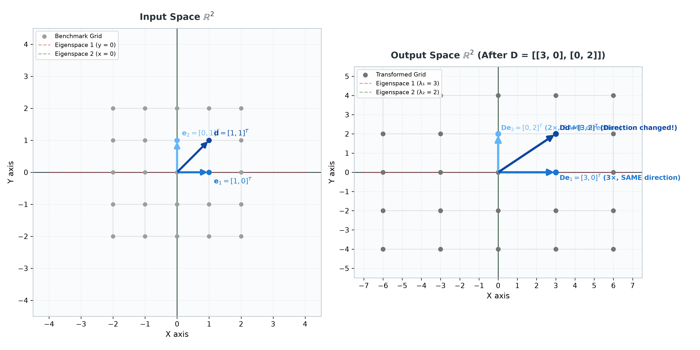

*Figure 2.3: Side-by-side transformation by diagonal matrix $\mathbf{D} = \text{diag}(3, 2)$. Left: Input Space. Right: Transformed Output Space. Both panels feature the neutral grey benchmark grid and tick intervals of 1. Notice how $\mathbf{e}_1$ (Medium Blue) and $\mathbf{e}_2$ (Light Blue) maintain their direction along the red and green eigenspaces, while the diagonal vector $\mathbf{d}$ (Dark Navy Blue) tilts.*

👉 **[Open Interactive Figure 2.3 in Browser](https://thisispk48.github.io/workshops/20260926_sju_26bda_pca/assets/2_3_fig_diagonal_transform.html)**

</div>

### Tracking our 5 vectors under $\mathbf{D}$:
1. 🔵 $\mathbf{e}_1 = [1, 0]^T$ (Medium Blue) $\to \mathbf{D}\mathbf{e}_1 = [3, 0]^T$: **Direction strictly preserved!** Stretched by $3\times$ along the X-axis (Eigenspace 1 line $y = 0$, $\lambda_1 = 3$).
2. 🔷 $\mathbf{e}_2 = [0, 1]^T$ (Light Blue) $\to \mathbf{D}\mathbf{e}_2 = [0, 2]^T$: **Direction strictly preserved!** Stretched by $2\times$ along the Y-axis (Eigenspace 2 line $x = 0$, $\lambda_2 = 2$).
3. 🟦 $\mathbf{d} = [1, 1]^T$ (Dark Navy Blue) $\to \mathbf{D}\mathbf{d} = [3, 2]^T$: **Direction changed!** Slope changed from $1$ to $\frac{2}{3}$.

### The Big Lesson:
> An **Eigenvector** is a vector that **retains its directional span (line of action)** under a linear transformation:
> 
> $$\mathbf{M} \mathbf{v} = \lambda \mathbf{v}$$

> 
> When transformed by $\mathbf{M}$, the vector **does not change its direction**—it is purely scaled by the scalar factor $\lambda$ (the **Eigenvalue**).

- **Specific ($\mathbb{R}^2 \to \mathbb{R}^2, 2 \times 2$):**  
  An eigenvector defines an invariant 1-dimensional straight line through the origin ($y = mx$). Every point on that line stays on that line, simply scaled by $\lambda$. In our $2 \times 2$ diagonal example, the two eigenspaces are the X-axis ($y = 0$, $\lambda_1 = 3$) and the Y-axis ($x = 0$, $\lambda_2 = 2$).

- **Generic ($\mathbb{R}^n \to \mathbb{R}^n, n \times n$):**  
  For any operator $\mathbf{M} \in \mathbb{R}^{n \times n}$, an eigenvalue $\lambda$ corresponds to an entire **Eigenspace** $E_\lambda$, defined as the null space of $(\mathbf{M} - \lambda\mathbf{I})$:

$$E_\lambda = \text{null}(\mathbf{M} - \lambda\mathbf{I}) = \{\mathbf{v} \in \mathbb{R}^n : \mathbf{M}\mathbf{v} = \lambda\mathbf{v}\}$$

  This is a linear subspace of dimension $1 \le k \le n$ (the geometric multiplicity). In $\mathbb{R}^3$, an eigenspace can be an invariant line or an invariant plane; in $\mathbb{R}^n$, it is an invariant $k$-dimensional hyperplane. Every vector in $E_\lambda$ scales by the exact same factor $\lambda$.

---

## 2.4 Tilted Eigenvectors: The Non-Diagonal Matrix

In the diagonal matrix above, the eigenvectors conveniently coincided with the familiar X and Y axes. But what happens in a general **non-diagonal matrix**?

To explore this, consider the matrix $\mathbf{A}$:

$$\mathbf{A}$$

Here, the eigenvalues and eigenvectors are not obvious just by looking at the numbers. We need a general method to discover them.

---

### Step 1: Setting up the Equation (The "How")

By definition, we are searching for a non-zero vector $\mathbf{v}$ and a scalar $\lambda$ such that:

$$\mathbf{A}\mathbf{v} = \lambda\mathbf{v}$$

Move everything to the left side:

$$\mathbf{A}\mathbf{v} - \lambda\mathbf{v} = \mathbf{0}$$

We want to factor out vector $\mathbf{v}$. However, we cannot directly subtract a scalar number $\lambda$ from a matrix $\mathbf{A}$. To fix this, we insert the Identity matrix $\mathbf{I}$ (since $\lambda\mathbf{v} = \lambda\mathbf{I}\mathbf{v}$):

$$(\mathbf{A} - \lambda\mathbf{I})\mathbf{v} = \mathbf{0}$$

---

### Step 2: Why Must the Determinant Equal Zero? (The "Why")

Let $\mathbf{B} = (\mathbf{A} - \lambda\mathbf{I})$. Our equation is now:

$$\mathbf{B}\mathbf{v} = \mathbf{0}$$

Notice the fundamental dilemma:
- If $\mathbf{v} = \mathbf{0}$, the equation is trivially true ($\mathbf{B}\mathbf{0} = \mathbf{0}$). But the zero vector has no direction—it tells us nothing about space (the **trivial solution**).
- We demand a **real, non-zero vector** ($\mathbf{v} \ne \mathbf{0}$) that satisfies the equation.

**What does it mean geometrically when a matrix squashes a non-zero vector down into $(0, 0)$?**
It means the matrix **collapses space!** It squashes 2-dimensional area down into a 1-dimensional line (or point).

- The **determinant** measures how much a matrix scales area. If 2D space is crushed into a 1D line, its 2D area becomes **zero**!
- If $\det(\mathbf{B}) \ne 0$, the matrix $\mathbf{B}$ would be invertible, which would force $\mathbf{v} = \mathbf{B}^{-1}\mathbf{0} = \mathbf{0}$ (only the useless zero solution would exist).
- Therefore, for a non-zero eigenvector to exist, the matrix **must collapse space**:

$$\det(\mathbf{A} - \lambda\mathbf{I}) = 0 \quad \text{(The Characteristic Equation)}$$

---

### Step 3: The Characteristic Equation

- **Specific ($\mathbb{R}^2 \to \mathbb{R}^2, 2 \times 2$):**  
  For any general $2 \times 2$ matrix $\mathbf{A}$:

$$\mathbf{A} = \begin{bmatrix} a & b \\\\ c & d \end{bmatrix}$$

$$\det\begin{bmatrix} a - \lambda & b \\\\ c & d - \lambda \end{bmatrix} = (a - \lambda)(d - \lambda) - bc = 0$$

$$\lambda^2 - (a + d)\lambda + (ad - bc) = 0$$

  Notice the two fundamental matrix invariants that appear naturally:
  1. **The Trace:** $\text{Tr}(\mathbf{A}) = a + d$ (sum of diagonal entries)
  2. **The Determinant:** $\det(\mathbf{A}) = ad - bc$
  
  This yields the universal $2 \times 2$ characteristic formula:

$$\lambda^2 - \text{Tr}(\mathbf{A})\lambda + \det(\mathbf{A}) = 0$$

  where $\lambda_1 + \lambda_2 = \text{Tr}(\mathbf{A})$ and $\lambda_1 \lambda_2 = \det(\mathbf{A})$.

- **Generic ($\mathbb{R}^n \to \mathbb{R}^n, n \times n$):**  
  For any $n \times n$ matrix $\mathbf{A} \in \mathbb{R}^{n \times n}$, expanding $\det(\mathbf{A} - \lambda\mathbf{I}) = 0$ yields an **$n$-th degree characteristic polynomial** in $\lambda$:

$$p(\lambda) = (-1)^n \lambda^n + (-1)^{n-1}\text{Tr}(\mathbf{A})\lambda^{n-1} + \dots + \det(\mathbf{A}) = 0$$

  By the Fundamental Theorem of Algebra, it has exactly $n$ roots (eigenvalues $\lambda_1, \lambda_2, \dots, \lambda_n$, counted with algebraic multiplicity). The trace and determinant invariant identities generalize universally to $\mathbb{R}^n$:

$$\sum_{i=1}^n \lambda_i = \text{Tr}(\mathbf{A}) = \sum_{i=1}^n A_{ii}, \qquad \prod_{i=1}^n \lambda_i = \det(\mathbf{A})$$

---

### Step 4: Applying the Machinery to Our Example

Now we can solve our non-diagonal matrix $\mathbf{A}$:

1. **Calculate Trace & Determinant:**
   - $\text{Tr}(\mathbf{A}) = 1 + 4 = 5$
   - $\det(\mathbf{A}) = (1)(4) - (1)(-2) = 4 + 2 = 6$

2. **Characteristic Equation:**

$$\lambda^2 - 5\lambda + 6 = 0$$

$$(\lambda - 3)(\lambda - 2) = 0 \implies \lambda_1 = 3, \quad \lambda_2 = 2$$

3. **Finding the Direction Lines (Eigenvectors):**  
   Substitute each $\lambda$ back into $(\mathbf{A} - \lambda\mathbf{I})\mathbf{v} = \mathbf{0}$. Because the matrix collapsed space, the two row equations are redundant multiples of each other—they reduce to a single invariant line:

   - **For $\lambda_1 = 3$:**

$$\begin{bmatrix} 1 - 3 & 1 \\\\ -2 & 4 - 3 \end{bmatrix} \begin{bmatrix} x \\\\ y \end{bmatrix} = \begin{bmatrix} -2 & 1 \\\\ -2 & 1 \end{bmatrix} \begin{bmatrix} x \\\\ y \end{bmatrix} = \begin{bmatrix} 0 \\\\ 0 \end{bmatrix}$$

     Both rows state: $-2x + y = 0 \implies y = 2x$.  
     Any vector along the line $y = 2x$ is an eigenvector! We choose the simple integer representative:

$$\mathbf{v}_1 = \begin{bmatrix} 1 \\\\ 2 \end{bmatrix} \quad (\text{Eigenvalue } \lambda_1 = 3)$$

   - **For $\lambda_2 = 2$:**

$$\begin{bmatrix} 1 - 2 & 1 \\\\ -2 & 4 - 2 \end{bmatrix} \begin{bmatrix} x \\\\ y \end{bmatrix} = \begin{bmatrix} -1 & 1 \\\\ -2 & 2 \end{bmatrix} \begin{bmatrix} x \\\\ y \end{bmatrix} = \begin{bmatrix} 0 \\\\ 0 \end{bmatrix}$$

     Both rows state: $-x + y = 0 \implies y = x$.  
     Any vector along the line $y = x$ is an eigenvector:

$$\mathbf{v}_2 = \begin{bmatrix} 1 \\\\ 1 \end{bmatrix} \quad (\text{Eigenvalue } \lambda_2 = 2)$$

<div align="center">

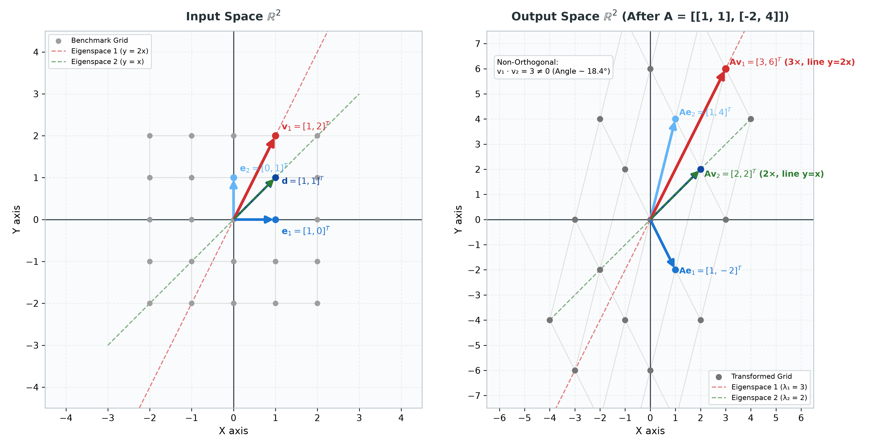

*Figure 2.4: Side-by-side transformation by non-diagonal matrix $\mathbf{A}$. Notice where each of the 5 vectors land. Eigenvectors $\mathbf{v}_1$ (Red) and $\mathbf{v}_2$ (Green) strictly preserve their directional lines, but are NOT perpendicular ($\theta \approx 18.4^\circ$).*

👉 **[Open Interactive Figure 2.4 in Browser](https://thisispk48.github.io/workshops/20260926_sju_26bda_pca/assets/2_4_fig_nondiagonal_transform.html)**

</div>

### Tracking our 5 vectors under $\mathbf{A}$:
1. 🔵 $\mathbf{e}_1 = [1, 0]^T$ (Medium Blue) $\to \mathbf{A}\mathbf{e}_1 = [1, -2]^T$: **Direction changed!**
2. 🔷 $\mathbf{e}_2 = [0, 1]^T$ (Light Blue) $\to \mathbf{A}\mathbf{e}_2 = [1, 4]^T$: **Direction changed!**
3. 🟦 $\mathbf{d} = [1, 1]^T$ (Dark Navy Blue) $\to \mathbf{A}\mathbf{d} = [2, 2]^T$: Lands on line $y = x$ (coincides with $\mathbf{v}_2$).
4. 🔴 $\mathbf{v}_1 = [1, 2]^T$ (Red) $\to \mathbf{A}\mathbf{v}_1 = [3, 6]^T$: **Direction strictly preserved on line $y = 2x$!** Stretched by $\lambda_1 = 3\times$.
5. 🟢 $\mathbf{v}_2 = [1, 1]^T$ (Green) $\to \mathbf{A}\mathbf{v}_2 = [2, 2]^T$: **Direction strictly preserved on line $y = x$!** Stretched by $\lambda_2 = 2\times$.

### The Critical Eye-Opener:
Look at the angle between the two eigenvectors:

$$\mathbf{v}_1 \cdot \mathbf{v}_2 = (1)(1) + (2)(1) = 3 \ne 0$$

$$\cos(\theta) = \frac{\mathbf{v}_1 \cdot \mathbf{v}_2}{\|\mathbf{v}_1\| \|\mathbf{v}_2\|} = \frac{3}{\sqrt{5}\sqrt{2}} = \frac{3}{\sqrt{10}} \approx 0.9487 \implies \theta \approx 18.4^\circ$$

> **Key Insight:** In general non-diagonal matrices, eigenvectors are **tilted** away from the standard axes, but they are **NOT orthogonal ($90^\circ$)**. The transformation shears space along non-perpendicular directions.

---

## 2.5 The Power of Symmetry: Strictly Orthogonal Eigenvectors

Now consider a **symmetric matrix** $\mathbf{S}$ (where $\mathbf{S}^T = \mathbf{S}$):

$$\mathbf{S}$$

> **Pedagogical Notation Note:**  
> In Section 2.4, we denoted the eigenvectors of general matrices by $\mathbf{v}_1, \mathbf{v}_2$. For symmetric matrices, we transition to the symbol $\mathbf{q}_1, \mathbf{q}_2$—the universal mathematical convention reserving the letter $\mathbf{q}$ for strictly **orthogonal/orthonormal** vectors (as in the orthogonal matrix $\mathbf{Q}$).

### Step 1: Characteristic Equation (Using Trace & Determinant)
For $\mathbf{S}$:
- $\text{Tr}(\mathbf{S}) = 3 + 3 = 6$
- $\det(\mathbf{S}) = (3)(3) - (1)(1) = 8$

Using our formula $\lambda^2 - \text{Tr}(\mathbf{S})\lambda + \det(\mathbf{S}) = 0$:

$$\lambda^2 - 6\lambda + 8 = 0 \implies (\lambda - 4)(\lambda - 2) = 0 \implies \lambda_1 = 4, \quad \lambda_2 = 2$$

### Step 2: Finding the Eigenvectors
- **For $\lambda_1 = 4$:**

$$(\mathbf{S} - 4\mathbf{I})\mathbf{q}_1 = \begin{bmatrix} -1 & 1 \\\\ 1 & -1 \end{bmatrix} \begin{bmatrix} x \\\\ y \end{bmatrix} = \begin{bmatrix} 0 \\\\ 0 \end{bmatrix} \implies y = x \implies \mathbf{q}_1 = \begin{bmatrix} 1 \\\\ 1 \end{bmatrix}$$

- **For $\lambda_2 = 2$:**

$$(\mathbf{S} - 2\mathbf{I})\mathbf{q}_2 = \begin{bmatrix} 1 & 1 \\\\ 1 & 1 \end{bmatrix} \begin{bmatrix} x \\\\ y \end{bmatrix} = \begin{bmatrix} 0 \\\\ 0 \end{bmatrix} \implies y = -x \implies \mathbf{q}_2 = \begin{bmatrix} -1 \\\\ 1 \end{bmatrix}$$

<div align="center">

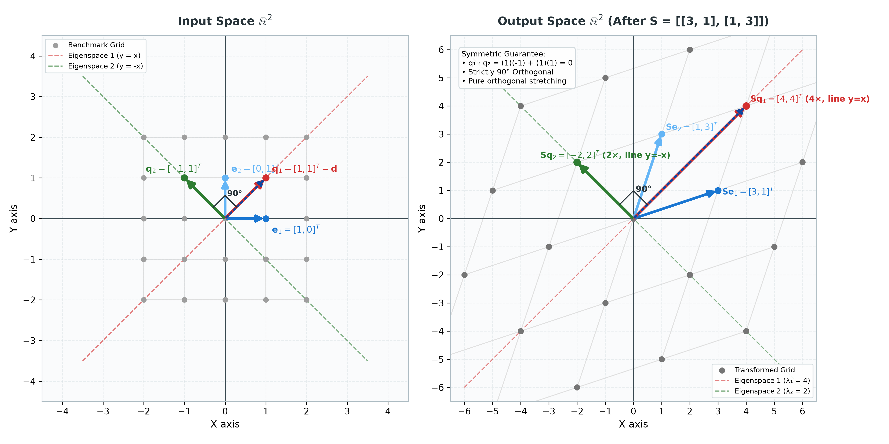

*Figure 2.5: Side-by-side transformation by symmetric matrix $\mathbf{S}$. Notice the $90^\circ$ right-angle marker in both panels: Eigenvectors $\mathbf{q}_1$ (Red) and $\mathbf{q}_2$ (Green) are STRICTLY PERPENDICULAR ($\mathbf{q}_1 \cdot \mathbf{q}_2 = 0$).*

👉 **[Open Interactive Figure 2.5 in Browser](https://thisispk48.github.io/workshops/20260926_sju_26bda_pca/assets/2_5_fig_symmetric_transform.html)**

</div>

### Tracking our 5 vectors under $\mathbf{S}$:
1. 🔵 $\mathbf{e}_1 = [1, 0]^T$ (Medium Blue) $\to \mathbf{S}\mathbf{e}_1 = [3, 1]^T$: **Direction changed!**
2. 🔷 $\mathbf{e}_2 = [0, 1]^T$ (Light Blue) $\to \mathbf{S}\mathbf{e}_2 = [1, 3]^T$: **Direction changed!**
3. 🟦 $\mathbf{d} = [1, 1]^T$ (Dark Navy Blue) $\to \mathbf{S}\mathbf{d} = [4, 4]^T$: Diagonal benchmark vector (coincides with $\mathbf{q}_1$).
4. 🔴 $\mathbf{q}_1 = [1, 1]^T$ (Red) $\to \mathbf{S}\mathbf{q}_1 = [4, 4]^T$: **Direction strictly preserved on line $y = x$!** Stretched by $\lambda_1 = 4\times$.
5. 🟢 $\mathbf{q}_2 = [-1, 1]^T$ (Green) $\to \mathbf{S}\mathbf{q}_2 = [-2, 2]^T$: **Direction strictly preserved on line $y = -x$!** Stretched by $\lambda_2 = 2\times$.

### The Miracle of Symmetry:
Look at the dot product between the eigenvectors:

$$\mathbf{q}_1 \cdot \mathbf{q}_2 = (1)(-1) + (1)(1) = 0$$

The angle between them is **exactly $90^\circ$** on both the input and output sides!

> **The Fundamental Discovery:**  
> While non-diagonal matrices have skewed eigenvectors, a **symmetric matrix always stretches space along mutually perpendicular ($90^\circ$) axes**. It produces a rigid, rotated orthogonal coordinate frame.

---

## 2.6 Special Properties of Symmetric Matrices

Symmetric matrices ($\mathbf{S}^T = \mathbf{S}$) possess fundamental mathematical properties that set them apart from all other square matrices:

### 1. All Eigenvalues are Real Numbers
- **Specific ($\mathbb{R}^2 \to \mathbb{R}^2, 2 \times 2$):**  
  For any $2 \times 2$ symmetric matrix $\mathbf{S}$ with entries $a, b, c$:

$$\mathbf{S} = \begin{bmatrix} a & b \\\\ b & c \end{bmatrix}$$

  The characteristic equation is $\lambda^2 - (a + c)\lambda + (ac - b^2) = 0$. Its discriminant is:

$$\Delta = (a + c)^2 - 4(ac - b^2) = (a - c)^2 + 4b^2 \ge 0$$

  Because $\Delta$ is the sum of two squares, it is never negative. A $2 \times 2$ symmetric matrix can never yield complex or imaginary eigenvalues.
- **Generic ($\mathbb{R}^n \to \mathbb{R}^n, n \times n$):**  
  For any real symmetric matrix $\mathbf{S} \in \mathbb{R}^{n \times n}$, every eigenvalue is guaranteed to be a real number:

$$\lambda_i \in \mathbb{R} \quad \forall i \in \{1, 2, \dots, n\}$$

---

### 2. Eigenvectors are Strictly Orthogonal
- **Specific ($\mathbb{R}^2 \to \mathbb{R}^2, 2 \times 2$):**  
  The two eigenvectors $\mathbf{q}_1$ and $\mathbf{q}_2$ are strictly perpendicular at $90^\circ$:

$$\mathbf{q}_1 \cdot \mathbf{q}_2 = 0 \quad (\mathbf{q}_1 \perp \mathbf{q}_2)$$

  As demonstrated in Figure 2.5, the symmetric matrix stretches space along this rigid $90^\circ$ coordinate frame.
- **Generic ($\mathbb{R}^n \to \mathbb{R}^n, n \times n$):**  
  By the **Spectral Theorem**, eigenvectors corresponding to distinct eigenvalues of any symmetric matrix are always mutually orthogonal. Furthermore, even if eigenvalues repeat, one can always construct a complete orthonormal basis $\{\mathbf{q}_1, \mathbf{q}_2, \dots, \mathbf{q}_n\}$ spanning $\mathbb{R}^n$:

$$\mathbf{q}_i \cdot \mathbf{q}_j = \delta_{ij} = \begin{cases} 1 & \text{if } i = j \\\\ 0 & \text{if } i \ne j \end{cases}$$

> **Side Note on Repeated Eigenvalues & Multiplicity:**  
> What happens if an eigenvalue repeats (e.g., $(\lambda - 3)^2 = 0$)?
> - **Algebraic Multiplicity (AM):** How many times a root $\lambda$ repeats in the characteristic polynomial.
> - **Geometric Multiplicity (GM):** The dimension of the eigenspace $\dim(\text{null}(\mathbf{S} - \lambda\mathbf{I}))$.
> - While general non-symmetric matrices can be "defective" ($\text{GM} < \text{AM}$, lacking enough independent eigenvectors), **symmetric matrices always satisfy $\mathbf{GM = AM}$**.
> - If an eigenvalue repeats $k$ times ($\text{AM} = k$), its eigenspace is guaranteed to be a full **$k$-dimensional subspace** where every single vector scales by $\lambda$. Within that $k$-dimensional subspace, one can always pick $k$ mutually perpendicular unit vectors (e.g., via Gram-Schmidt) to construct a full orthonormal basis spanning $\mathbb{R}^n$.

---

### 3. Rank of a Symmetric Matrix
Is the rank of a symmetric matrix guaranteed to equal its dimension? **No.**

- **Specific ($\mathbb{R}^2 \to \mathbb{R}^2, 2 \times 2$):**  
  For a $2 \times 2$ symmetric matrix:
  - **Rank 2 (Full Rank):** Both $\lambda_1 \ne 0$ and $\lambda_2 \ne 0$ (e.g., our benchmark matrix $\mathbf{S}$ with $\lambda_1 = 4, \lambda_2 = 2$). The matrix is invertible and spans all of $\mathbb{R}^2$.
  - **Rank 1:** Exactly one eigenvalue is 0 (e.g., a line projector with $\lambda_1 = 2, \lambda_2 = 0$). Space collapses completely from 2D onto a 1D line.
  - **Rank 0:** Both eigenvalues are 0 (only the zero matrix $\mathbf{S} = \mathbf{0}$).
- **Generic ($\mathbb{R}^n \to \mathbb{R}^n, n \times n$):**  
  The rank of any symmetric matrix $\mathbf{S}$ is **strictly equal to the number of non-zero eigenvalues**:

$$\text{rank}(\mathbf{S}) = r = \text{Count of } \{\lambda_i \ne 0\} \le n$$

  An $n \times n$ symmetric matrix is full rank ($r = n$) if and only if zero is not an eigenvalue.

---

### 4. Spectral Decomposition (Sum of Rank-1 Projections)
Because the eigenvectors form an orthonormal basis ($\mathbf{Q}^T \mathbf{Q} = \mathbf{I}$), any symmetric matrix $\mathbf{S}$ can be factored as $\mathbf{S} = \mathbf{Q} \mathbf{\Lambda} \mathbf{Q}^T$:

- **Specific ($\mathbb{R}^2 \to \mathbb{R}^2, 2 \times 2$):**  

$$\mathbf{S} = \lambda_1 (\mathbf{q}_1 \mathbf{q}_1^T) + \lambda_2 (\mathbf{q}_2 \mathbf{q}_2^T)$$

  Each outer product $(\mathbf{q}_i \mathbf{q}_i^T)$ is an $n \times n$ matrix of **rank 1**—the exact 1D orthogonal projection matrix onto line $\text{span}(\mathbf{q}_i)$ from Section 1.2!
  - If $\mathbf{S}$ is **Full Rank** ($\text{rank} = 2$), $\mathbf{S}$ is a weighted sum of **two active rank-1 projection matrices**.
  - If $\mathbf{S}$ is **Rank 1** ($\lambda_2 = 0$), the second term vanishes, leaving $\mathbf{S} = \lambda_1 (\mathbf{q}_1 \mathbf{q}_1^T)$ as a single active rank-1 projection matrix.

- **Generic ($\mathbb{R}^n \to \mathbb{R}^n, n \times n$):**  
  For any symmetric $\mathbf{S} \in \mathbb{R}^{n \times n}$ with rank $r \le n$:

$$\mathbf{S} = \sum_{i=1}^n \lambda_i (\mathbf{q}_i \mathbf{q}_i^T) = \sum_{i=1}^r \lambda_i (\mathbf{q}_i \mathbf{q}_i^T)$$

  where each $\mathbf{P}_i = \mathbf{q}_i \mathbf{q}_i^T$ is a **rank-1** orthogonal projector, satisfying $\mathbf{P}_i^2 = \mathbf{P}_i$ and $\mathbf{P}_i \mathbf{P}_j = \mathbf{0}$ for $i \ne j$.
  
  > **Key Geometric Takeaway:**  
  > Any symmetric matrix is nothing more than a **weighted linear combination of $r$ orthogonal rank-1 projection matrices**, where the weights are its non-zero eigenvalues!

---

### 5. Always Orthogonally Diagonalizable
- **Specific ($\mathbb{R}^2 \to \mathbb{R}^2, 2 \times 2$):**  
  $\mathbf{S} = \mathbf{Q}\mathbf{\Lambda}\mathbf{Q}^T$, where $\mathbf{Q}$ is a $2 \times 2$ rotation/reflection matrix.
- **Generic ($\mathbb{R}^n \to \mathbb{R}^n, n \times n$):**  
  Every symmetric matrix in $\mathbb{R}^{n \times n}$ is orthogonally diagonalizable ($\mathbf{Q}^T \mathbf{S} \mathbf{Q} = \mathbf{\Lambda}$). Unlike general matrices (which may lack enough eigenvectors or produce skewed, sheared axes), a symmetric matrix **never shears space**—it purely rotates the coordinate frame to line up with its eigenvectors and scales each perpendicular axis by $\lambda_i$.

---

### 6. Positive Semi-Definite (PSD) & Positive Definite (PD) Symmetric Matrices

What happens when a symmetric matrix acts on space? Can it flip vectors backwards into the opposite direction?

To measure whether a transformation preserves or reverses orientation, we evaluate the **quadratic form** $\mathbf{v}^T \mathbf{S} \mathbf{v}$ for an arbitrary non-zero vector $\mathbf{v}$:

$$\mathbf{v}^T \mathbf{S} \mathbf{v} = \mathbf{v} \cdot (\mathbf{S}\mathbf{v}) = \|\mathbf{v}\| \|\mathbf{S}\mathbf{v}\| \cos(\theta)$$

where $\theta$ is the angle between the original vector $\mathbf{v}$ and the transformed vector $\mathbf{S}\mathbf{v}$.

- **Specific ($\mathbb{R}^2 \to \mathbb{R}^2, 2 \times 2$):**  
  Take our symmetric matrix $\mathbf{S}$ from Figure 2.5 and an arbitrary vector $\mathbf{v} = \begin{bmatrix} v_1 \\\\ v_2 \end{bmatrix}$:

$$\mathbf{v}^T \mathbf{S} \mathbf{v} = \begin{bmatrix} v_1 & v_2 \end{bmatrix} \begin{bmatrix} 3 & 1 \\\\ 1 & 3 \end{bmatrix} \begin{bmatrix} v_1 \\\\ v_2 \end{bmatrix} = 3v_1^2 + 2v_1 v_2 + 3v_2^2$$

  Notice how this quadratic expression rewrites:

$$3v_1^2 + 2v_1 v_2 + 3v_2^2 = 2(v_1^2 + v_2^2) + (v_1 + v_2)^2$$

  Because $v_1^2 + v_2^2 > 0$ for any non-zero vector and $(v_1 + v_2)^2 \ge 0$, **this value is strictly positive for every possible vector**!
  - **Geometric Meaning:** $\mathbf{v} \cdot (\mathbf{S}\mathbf{v}) > 0 \implies \cos(\theta) > 0 \implies \theta < 90^\circ$.  
    The matrix $\mathbf{S}$ **never flips any vector backwards**! Every vector is rotated by less than $90^\circ$.
  - **Connection to Eigenvalues:**  
    If we test the quadratic form on an eigenvector $\mathbf{q}_i$:

$$\mathbf{q}_i^T \mathbf{S} \mathbf{q}_i = \mathbf{q}_i^T (\lambda_i \mathbf{q}_i) = \lambda_i \|\mathbf{q}_i\|^2 = \lambda_i$$

    Because $\mathbf{v}^T \mathbf{S} \mathbf{v} > 0$ for all non-zero vectors, **all eigenvalues must be strictly positive**: $\lambda_1 = 4 > 0, \lambda_2 = 2 > 0$.

- **Generic ($\mathbb{R}^n \to \mathbb{R}^n, n \times n$):**  
  For any real symmetric matrix $\mathbf{S} \in \mathbb{R}^{n \times n}$:
  1. **Positive Definite (PD):**  
     $\mathbf{v}^T \mathbf{S} \mathbf{v} > 0$ for all $\mathbf{v} \ne \mathbf{0} \iff$ **All eigenvalues are strictly positive ($\lambda_i > 0$)**.  
     Space stretches outward along all axes; the matrix is full rank and invertible.
  2. **Positive Semi-Definite (PSD):**  
     $\mathbf{v}^T \mathbf{S} \mathbf{v} \ge 0$ for all $\mathbf{v} \iff$ **All eigenvalues are non-negative ($\lambda_i \ge 0$)**.  
     Space may collapse flat along axes where $\lambda_i = 0$, but it never inverts or reflects backwards.
  3. **Indefinite:**  
     Has both positive and negative eigenvalues ($\lambda_1 > 0, \lambda_2 < 0$). Space stretches along some axes and flips backwards along others (forming a saddle shape).

> **Crucial Preview for Part 3:**  
> In Part 3, we will see that the Covariance Matrix $\mathbf{\Sigma} = \frac{1}{N-1}\mathbf{X}_c^T \mathbf{X}_c$ is **guaranteed to be Positive Semi-Definite**. Why? Because $\mathbf{u}^T \mathbf{\Sigma} \mathbf{u}$ represents the **variance** of data along direction $\mathbf{u}$, and physical variance (a sum of squared deviations) can never be negative!

---

# Part 3: From Data Cloud to Principal Components (The Geometry of PCA)

In Part 1, we answered:
> *"If someone hands you a direction $\mathbf{u}$, how do you project data onto it?"*  
> Answer: Use the orthogonal projection matrix $\mathbf{P} = \mathbf{u}\mathbf{u}^T$.

In Part 2, we answered:
> *"What mathematical machines possess rigid, mutually perpendicular axes of variation?"*  
> Answer: **Symmetric matrices**, whose eigenvectors are strictly orthogonal ($90^\circ$).

Now, in Part 3, we unite these two pillars to answer the central question of modern Data Science:
> **"In a cloud of real-world data, who chooses the best direction $\mathbf{u}$? How do we discover the natural spine of the data?"**

---

## 3.1 The Real-World Data Cloud & Centering (Height vs. Weight)

In real-world data science, observations rarely come as isolated mathematical vectors—they come as collections of measurements on individuals.

Consider a dataset of $N = 40$ individuals measured on $D = 2$ physical attributes (Height and Weight).

In linear algebra, our raw data matrix $\mathbf{X}_{40 \times 2}$ is a $40 \times 2$ matrix that unites two clean geometric viewpoints:
- **Every row is an individual observation vector in $\mathbb{R}^2$:**  

$$\mathbf{r}_{i, 2 \times 1} = \begin{bmatrix} x_{i1} \\\\ x_{i2} \end{bmatrix}_{2 \times 1} \in \mathbb{R}^2 \quad (\text{represented as row } \mathbf{r}_{i, 1 \times 2}^T \text{ in } \mathbf{X}_{40 \times 2})$$

- **Every column is a feature vector across all 40 individuals in $\mathbb{R}^{40}$:**  

$$\mathbf{x}_{1, 40 \times 1} \in \mathbb{R}^{40} \quad (\text{Height column}), \qquad \mathbf{x}_{2, 40 \times 1} \in \mathbb{R}^{40} \quad (\text{Weight column})$$

$$\mathbf{X}_{40 \times 2} = \underbrace{\begin{bmatrix} (\mathbf{x}_1)_{40 \times 1} & (\mathbf{x}_2)_{40 \times 1} \end{bmatrix}}_{2 \text{ column vectors in } \mathbb{R}^{40}} = \underbrace{\begin{bmatrix} (\mathbf{r}_1^T)_{1 \times 2} \\\\ (\mathbf{r}_2^T)_{1 \times 2} \\\\ \vdots \\\\ (\mathbf{r}_{40}^T)_{1 \times 2} \end{bmatrix}}_{40 \text{ row vectors from } \mathbb{R}^2}$$

To keep calculations completely transparent and verifiable by hand with pencil and paper, we focus our step-by-step arithmetic on **5 clean benchmark individuals (Persons A through E)**, accompanied by 35 peer observations that form the realistic data cloud (all sharing the exact same center of mass $\mathbf{\mu}_{2 \times 1} = [4, 3]^T$):

$$\mathbf{X}_{\text{bench}, 5 \times 2} = \begin{bmatrix} (\mathbf{r}_A^T)_{1 \times 2} \\\\ (\mathbf{r}_B^T)_{1 \times 2} \\\\ (\mathbf{r}_C^T)_{1 \times 2} \\\\ (\mathbf{r}_D^T)_{1 \times 2} \\\\ (\mathbf{r}_E^T)_{1 \times 2} \end{bmatrix}_{5 \times 2} = \begin{bmatrix} 6 & 4 \\\\ 2 & 2 \\\\ 5 & 5 \\\\ 3 & 1 \\\\ 4 & 3 \end{bmatrix}_{5 \times 2} \begin{matrix} \leftarrow \text{Person A} \\\\ \leftarrow \text{Person B} \\\\ \leftarrow \text{Person C} \\\\ \leftarrow \text{Person D} \\\\ \leftarrow \text{Person E} \end{matrix}$$

### Calculating the Center of Mass (Mean Vector $\mathbf{\mu}$)
Before analyzing how features vary, we compute the sample average for each feature column:

$$\bar{x}_1 = \frac{1}{N} \sum_{i=1}^N x_{i1} = 4.0, \qquad \bar{x}_2 = \frac{1}{N} \sum_{i=1}^N x_{i2} = 3.0$$

As demonstrated by our 5 benchmark individuals:

$$\bar{x}_1 = \frac{6 + 2 + 5 + 3 + 4}{5} = \frac{20}{5} = 4.0, \qquad \bar{x}_2 = \frac{4 + 2 + 5 + 1 + 3}{5} = \frac{15}{5} = 3.0$$

The **Center of Mass** (mean vector $\mathbf{\mu}_{2 \times 1} \in \mathbb{R}^2$) is:

$$\mathbf{\mu}_{2 \times 1} = \begin{bmatrix} \bar{x}_1 \\\\ \bar{x}_2 \end{bmatrix}_{2 \times 1} = \begin{bmatrix} 4.0 \\\\ 3.0 \end{bmatrix}_{2 \times 1}$$

Notice that the raw data cloud is offset into Quadrant 1, centered around the point $(4, 3)$.

---

### Why Centering is Mandatory ($(\mathbf{X}_c)_{40 \times 2} = \mathbf{X}_{40 \times 2} - \mathbf{1}_{40 \times 1} \mathbf{\mu}_{1 \times 2}^T$)

To analyze pure variation, we subtract the mean vector $\mathbf{\mu}_{2 \times 1}$ from every individual observation vector:

$$\tilde{\mathbf{r}}_{i, 2 \times 1} = \mathbf{r}_{i, 2 \times 1} - \mathbf{\mu}_{2 \times 1} = \begin{bmatrix} x_{i1} - \bar{x}_1 \\\\ x_{i2} - \bar{x}_2 \end{bmatrix}_{2 \times 1} \in \mathbb{R}^2$$

This centers every individual observation vector in $\mathbb{R}^2$, producing the centered $40 \times 2$ data matrix $(\mathbf{X}_c)_{40 \times 2}$ where every column is a centered feature vector $\tilde{\mathbf{x}}_{1, 40 \times 1}, \tilde{\mathbf{x}}_{2, 40 \times 1} \in \mathbb{R}^{40}$:

$$(\mathbf{X}_c)_{40 \times 2} = \begin{bmatrix} (\tilde{\mathbf{x}}_1)_{40 \times 1} & (\tilde{\mathbf{x}}_2)_{40 \times 1} \end{bmatrix}_{40 \times 2} = \begin{bmatrix} (\tilde{\mathbf{r}}_1^T)_{1 \times 2} \\\\ (\tilde{\mathbf{r}}_2^T)_{1 \times 2} \\\\ \vdots \\\\ (\tilde{\mathbf{r}}_{40}^T)_{1 \times 2} \end{bmatrix}_{40 \times 2}$$

For our 5 benchmark individuals:

$$\mathbf{X}_{c,\text{bench}, 5 \times 2} = \begin{bmatrix} 6 - 4 & 4 - 3 \\\\ 2 - 4 & 2 - 3 \\\\ 5 - 4 & 5 - 3 \\\\ 3 - 4 & 1 - 3 \\\\ 4 - 4 & 3 - 3 \end{bmatrix}_{5 \times 2} = \begin{bmatrix} +2 & +1 \\\\ -2 & -1 \\\\ +1 & +2 \\\\ -1 & -2 \\\\ 0 & 0 \end{bmatrix}_{5 \times 2} \begin{matrix} \leftarrow \text{Person A: } \tilde{\mathbf{r}}_{A, 2 \times 1} = [+2, +1]^T \\\\ \leftarrow \text{Person B: } \tilde{\mathbf{r}}_{B, 2 \times 1} = [-2, -1]^T \\\\ \leftarrow \text{Person C: } \tilde{\mathbf{r}}_{C, 2 \times 1} = [+1, +2]^T \\\\ \leftarrow \text{Person D: } \tilde{\mathbf{r}}_{D, 2 \times 1} = [-1, -2]^T \\\\ \leftarrow \text{Person E: } \tilde{\mathbf{r}}_{E, 2 \times 1} = [0, 0]^T \end{matrix}$$

- **Specific ($\mathbb{R}^2 \to \mathbb{R}^2, 2 \times 2$):**  
  Every centered coordinate now tells a direct physical story relative to the average:
  - $\tilde{r}_{i1} = +2 \implies$ "2 units taller than average."
  - $\tilde{r}_{i1} = -2 \implies$ "2 units shorter than average."
  - $\tilde{r}_{i2} = +1 \implies$ "1 unit heavier than average."
  - $\tilde{r}_{i2} = -1 \implies$ "1 unit lighter than average."

- **Generic ($\mathbb{R}^D \to \mathbb{R}^D, D \times D$):**  
  Centering anchors the data cloud's center of mass at the origin:

$$\mathbf{0}_{D \times 1} = [0, 0, \dots, 0]^T \in \mathbb{R}^D$$

  Centering does **not** alter the shape of the data, the distances between points, or the variances. However, it is mathematically essential because linear transformations require $T(\mathbf{0}) = \mathbf{0}$ (from Section 2.1). Anchoring the mean at the origin ensures that linear matrix operations act purely on data spread without being distorted by arbitrary coordinate offsets.

<div align="center">

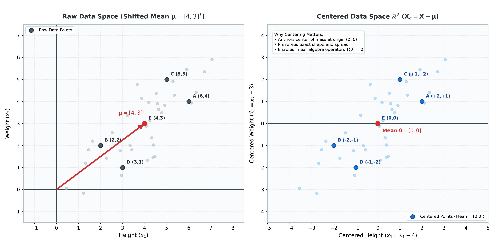

*Figure 3.1: The Geometry of Centering. Left: Raw data cloud offset by mean vector $\mathbf{\mu}_{2 \times 1} = [4, 3]^T$. Right: Centered data space $\mathbb{R}^2$ with center of mass anchored at $(0, 0)$.*

👉 **[Open Interactive Figure 3.1 in Browser](https://thisispk48.github.io/workshops/20260926_sju_26bda_pca/assets/3_1_fig_centering.html)**

</div>

---

## 3.2 Where Covariance is Born: The 4-Quadrant Deviation Story

Now we ask the fundamental data science question: **How do Height ($\mathbf{x}_{1, 40 \times 1}$) and Weight ($\mathbf{x}_{2, 40 \times 1}$) vary together?**

Before looking at matrices, let's understand how statistics packages individual and joint variation using vector dot products:
1. **Individual Spread (Sample Variance):**  
   The variance of Feature 1 ($\mathbf{x}_{1, 40 \times 1}$) is the average squared deviation across all $N$ individuals:

$$s_1^2 = \text{Var}(\mathbf{x}_1) = \frac{1}{N - 1} \sum_{i=1}^N \tilde{r}_{i1}^2 = \frac{1}{N - 1} \underbrace{\tilde{\mathbf{x}}_{1, 1 \times 40}^T}_{1 \times 40} \underbrace{\tilde{\mathbf{x}}_{1, 40 \times 1}}_{40 \times 1} = (1 \times 1) \text{ Scalar}$$

   The variance of Feature 2 ($\mathbf{x}_{2, 40 \times 1}$) is:

$$s_2^2 = \text{Var}(\mathbf{x}_2) = \frac{1}{N - 1} \sum_{i=1}^N \tilde{r}_{i2}^2 = \frac{1}{N - 1} \underbrace{\tilde{\mathbf{x}}_{2, 1 \times 40}^T}_{1 \times 40} \underbrace{\tilde{\mathbf{x}}_{2, 40 \times 1}}_{40 \times 1} = (1 \times 1) \text{ Scalar}$$

2. **Joint Spread (Sample Covariance):**  
   The degree to which deviations in Feature 1 correspond to deviations in Feature 2 is the **sample covariance**, denoted by $s_{12}$:

$$s_{12} = \text{Cov}(\mathbf{x}_1, \mathbf{x}_2) = \frac{1}{N - 1} \sum_{i=1}^N \tilde{r}_{i1} \tilde{r}_{i2} = \frac{1}{N - 1} \underbrace{\tilde{\mathbf{x}}_{1, 1 \times 40}^T}_{1 \times 40} \underbrace{\tilde{\mathbf{x}}_{2, 40 \times 1}}_{40 \times 1} = (1 \times 1) \text{ Scalar}$$

### Packaging the Spread: The Covariance Matrix $\mathbf{\Sigma}_{2 \times 2} = \frac{1}{N-1}(\mathbf{X}_c^T)_{2 \times 40} (\mathbf{X}_c)_{40 \times 2}$
To analyze all features together in a single operation, we evaluate the matrix product:

$$\mathbf{\Sigma}_{2 \times 2} = \frac{1}{N - 1} \underbrace{\mathbf{X}_{c, 2 \times 40}^T}_{2 \times 40} \, \underbrace{\mathbf{X}_{c, 40 \times 2}}_{40 \times 2} = \frac{1}{N - 1} \begin{bmatrix} \tilde{\mathbf{x}}_1^T \\\\ \tilde{\mathbf{x}}_2^T \end{bmatrix}_{2 \times 40} \begin{bmatrix} \tilde{\mathbf{x}}_1 & \tilde{\mathbf{x}}_2 \end{bmatrix}_{40 \times 2} = \begin{bmatrix} s_1^2 & s_{12} \\\\ s_{12} & s_2^2 \end{bmatrix}_{2 \times 2}$$

#### Dimension Verification:

$$\mathbf{\Sigma}_{2 \times 2} = \frac{1}{39} \underbrace{\mathbf{X}_{c, 2 \times 40}^T}_{2 \times 40} \, \underbrace{\mathbf{X}_{c, 40 \times 2}}_{40 \times 2} = (2 \times 2) \text{ Symmetric Matrix}$$

Notice that because dot products commute ($\tilde{\mathbf{x}}_{1, 1 \times 40}^T \tilde{\mathbf{x}}_{2, 40 \times 1} = \tilde{\mathbf{x}}_{2, 1 \times 40}^T \tilde{\mathbf{x}}_{1, 40 \times 1}$), the off-diagonal covariances are identical ($s_{12} = s_{21}$).  
Therefore, **$\mathbf{\Sigma}_{2 \times 2}$ is strictly a symmetric matrix ($\mathbf{\Sigma}_{2 \times 2}^T = \mathbf{\Sigma}_{2 \times 2}$)**! Everything we proved about symmetric matrices in Section 2.5 and 2.6 applies directly to covariance matrices.

> **Crucial Pedagogical Note for Students:**  
> Do **not** confuse the bold matrix symbol $\mathbf{\Sigma}$ with the summation operator $\sum_{i=1}^N$.  
> - $\sum$ is an operation: it means "add up a list of numbers."  
> - $\mathbf{\Sigma}_{2 \times 2}$ is a matrix object: it is a $2 \times 2$ table holding the geometric variances and covariances of your dataset.

---

### The 4-Quadrant Product Breakdown
Look closely at the sign of the deviation product $(\tilde{r}_{i1} \cdot \tilde{r}_{i2})$ across the 4 quadrants of our centered coordinate plane:

| Quadrant | Physical Meaning (Height, Weight) | Deviation Signs | Product $(\tilde{r}_{i1} \cdot \tilde{r}_{i2})$ | Contribution to Covariance |
| :--- | :--- | :--- | :--- | :--- |
| **Quadrant 1** | Taller than average, Heavier than average | $(+) \times (+)$ | **Positive ($+$)** | Increases Covariance |
| **Quadrant 3** | Shorter than average, Lighter than average | $(-) \times (-)$ | **Positive ($+$)** | Increases Covariance |
| **Quadrant 2** | Shorter than average, Heavier than average | $(-) \times (+)$ | **Negative ($-$)** | Decreases Covariance |
| **Quadrant 4** | Taller than average, Lighter than average | $(+) \times (-)$ | **Negative ($-$)** | Decreases Covariance |

---

### Deriving the Three Stories from Three Simulated Datasets ($N = 40$ each)

To see how covariance directly controls the geometric tilt of data, we examine our **three simulated datasets ($N = 40$ points each)**. Because our data generator carefully anchored the 5 clean benchmark individuals, you can verify the exact covariance values $\mathbf{\Sigma}_{2 \times 2}$ by calculating the sums on just these 5 individuals (divided by $5 - 1 = 4$), which yields the exact same sample covariance as the full 40-point cloud (divided by $40 - 1 = 39$):

#### Dataset 1: Positive Covariance (Height vs. Weight)
Consider our centered benchmark individuals where taller people are generally heavier:

$$\mathbf{X}_{c1,\text{bench}, 5 \times 2} = \begin{bmatrix} +2 & +1 \\\\ -2 & -1 \\\\ +1 & +2 \\\\ -1 & -2 \\\\ 0 & 0 \end{bmatrix}_{5 \times 2} \begin{matrix} \leftarrow \text{Person A: } \tilde{\mathbf{r}}_{A, 2 \times 1} = [+2, +1]^T \\\\ \leftarrow \text{Person B: } \tilde{\mathbf{r}}_{B, 2 \times 1} = [-2, -1]^T \\\\ \leftarrow \text{Person C: } \tilde{\mathbf{r}}_{C, 2 \times 1} = [+1, +2]^T \\\\ \leftarrow \text{Person D: } \tilde{\mathbf{r}}_{D, 2 \times 1} = [-1, -2]^T \\\\ \leftarrow \text{Person E: } \tilde{\mathbf{r}}_{E, 2 \times 1} = [0, 0]^T \end{matrix}$$

- $\sum \tilde{r}_{i1}^2 = 2^2 + (-2)^2 + 1^2 + (-1)^2 + 0^2 = 10 \implies s_1^2 = \frac{10}{4} = 2.5$
- $\sum \tilde{r}_{i2}^2 = 1^2 + (-1)^2 + 2^2 + (-2)^2 + 0^2 = 10 \implies s_2^2 = \frac{10}{4} = 2.5$
- $\sum \tilde{r}_{i1} \tilde{r}_{i2} = (+2)(+1) + (-2)(-1) + (+1)(+2) + (-1)(-2) + 0 = 2 + 2 + 2 + 2 = +8 \implies s_{12} = \frac{+8}{4} = \mathbf{+2.0}$

$$\mathbf{\Sigma}_{1, 2 \times 2} = \begin{bmatrix} 2.5 & \mathbf{+2.0} \\\\ \mathbf{+2.0} & 2.5 \end{bmatrix}_{2 \times 2}$$

- **The Story:** Observations fall strictly in **Q1 and Q3**. Positive products dominate. The data cloud **tilts upward to the right** along the positive diagonal ($y \approx x$).

---

#### Dataset 2: Negative Covariance (Elevation vs. Temperature)
Consider 5 centered benchmark observations where higher elevation corresponds to colder temperature:

$$\mathbf{X}_{c2,\text{bench}, 5 \times 2} = \begin{bmatrix} +2 & -1 \\\\ -2 & +1 \\\\ +1 & -2 \\\\ -1 & +2 \\\\ 0 & 0 \end{bmatrix}_{5 \times 2}$$

- $\sum \tilde{r}_{i1}^2 = 10 \implies s_1^2 = \frac{10}{4} = 2.5$
- $\sum \tilde{r}_{i2}^2 = 10 \implies s_2^2 = \frac{10}{4} = 2.5$
- $\sum \tilde{r}_{i1} \tilde{r}_{i2} = (+2)(-1) + (-2)(+1) + (+1)(-2) + (-1)(+2) + 0 = -2 - 2 - 2 - 2 = -8 \implies s_{12} = \frac{-8}{4} = \mathbf{-2.0}$

$$\mathbf{\Sigma}_{2, 2 \times 2} = \begin{bmatrix} 2.5 & \mathbf{-2.0} \\\\ \mathbf{-2.0} & 2.5 \end{bmatrix}_{2 \times 2}$$

- **The Story:** Observations fall strictly in **Q2 and Q4**. Negative products dominate. The data cloud **tilts downward to the right** along the negative diagonal ($y \approx -x$).

---

#### Dataset 3: Zero Covariance (Height vs. Shoe Brand / Uncorrelated)
Consider 5 centered benchmark observations distributed symmetrically along the standard axes:

$$\mathbf{X}_{c3,\text{bench}, 5 \times 2} = \begin{bmatrix} +2 & 0 \\\\ -2 & 0 \\\\ 0 & +2 \\\\ 0 & -2 \\\\ 0 & 0 \end{bmatrix}_{5 \times 2}$$

- $\sum \tilde{r}_{i1}^2 = 2^2 + (-2)^2 + 0 + 0 + 0 = 8 \implies s_1^2 = \frac{8}{4} = 2.0$
- $\sum \tilde{r}_{i2}^2 = 0 + 0 + 2^2 + (-2)^2 + 0 = 8 \implies s_2^2 = \frac{8}{4} = 2.0$
- $\sum \tilde{r}_{i1} \tilde{r}_{i2} = (2)(0) + (-2)(0) + (0)(2) + (0)(-2) + 0 = 0 \implies s_{12} = \frac{0}{4} = \mathbf{0.0}$

$$\mathbf{\Sigma}_{3, 2 \times 2} = \begin{bmatrix} 2.0 & \mathbf{0.0} \\\\ \mathbf{0.0} & 2.0 \end{bmatrix}_{2 \times 2}$$

- **The Story:** Positive and negative products cancel out completely. Knowing $\mathbf{x}_1$ provides zero predictive information about $\mathbf{x}_2$.
- *Direct Connection to Section 2.3:* This is a **diagonal matrix**! There is no tilt; its eigenvectors are already the standard coordinate axes.

<div align="center">

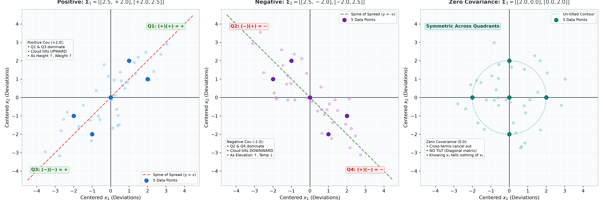

*Figure 3.2: The Three Stories of Covariance. Panel 1: Positive Covariance ($\mathbf{\Sigma}_{1, 2 \times 2}$, upward tilt along $y = x$). Panel 2: Negative Covariance ($\mathbf{\Sigma}_{2, 2 \times 2}$, downward tilt along $y = -x$). Panel 3: Zero Covariance ($\mathbf{\Sigma}_{3, 2 \times 2}$, un-tilted diagonal matrix).*

👉 **[Open Interactive Figure 3.2 in Browser](https://thisispk48.github.io/workshops/20260926_sju_26bda_pca/assets/3_2_fig_covariance_quadrants.html)**

</div>

---

## 3.3 The Core Question of PCA: Projecting onto Which Line $\mathbf{u}$ Maximizes Spread?

Now we arrive at the central problem of Principal Component Analysis:  
Suppose we want to compress our 40 individuals (where each centered observation is a vector in $\mathbb{R}^2$) down onto a **single 1D straight line** passing through the origin along a unit direction vector $\mathbf{u}_{2 \times 1} \in \mathbb{R}^2$ (with $\|\mathbf{u}\| = 1 \iff \mathbf{u}_{1 \times 2}^T \mathbf{u}_{2 \times 1} = 1$).

**Which line $\mathbf{u}_{2 \times 1}$ should we choose?**

In data science, **variance represents information**. If you project your data onto a line where all the points collapse on top of each other into a dense clump, you lose the ability to distinguish between individuals. But if you project onto a line where the points spread out as widely as possible, you retain the maximum possible amount of individual differences!

Therefore, the objective of PCA is:  
**Find the unit direction vector $\mathbf{u}_{2 \times 1} \in \mathbb{R}^2$ that maximizes the sample variance of the projected data points.**

---

### The Three-Line Derivation of the Variance Machine

How do we calculate the variance of our data along *any* arbitrary unit direction $\mathbf{u}_{2 \times 1}$? It takes just three simple, rigorous steps:

#### Step 1: Projecting Each Point onto Direction $\mathbf{u}$
From Section 1.2, the 1D shadow coordinate (scalar projection) of an individual centered observation vector $\tilde{\mathbf{r}}_{i, 2 \times 1} \in \mathbb{R}^2$ onto a unit vector $\mathbf{u}_{2 \times 1} \in \mathbb{R}^2$ is simply their dot product:

$$z_{i, 1 \times 1} = \underbrace{\tilde{\mathbf{r}}_{i, 1 \times 2}^T}_{1 \times 2} \, \underbrace{\mathbf{u}_{2 \times 1}}_{2 \times 1} = (1 \times 1) \text{ Scalar} \in \mathbb{R}$$

Physical meaning: $z_{i, 1 \times 1} \in \mathbb{R}$ is a single real number representing the exact 1D coordinate of Person $i$ along the line $\mathbf{u}_{2 \times 1}$.

Stacking the shadow coordinates of all 40 individuals gives a score vector $\mathbf{z}_{40 \times 1} \in \mathbb{R}^{40}$, computed for the entire dataset in a single matrix-vector multiplication $\mathbf{z}_{40 \times 1} = (\mathbf{X}_c)_{40 \times 2} \mathbf{u}_{2 \times 1}$:

$$\mathbf{z}_{40 \times 1} = \begin{bmatrix} z_1 \\\\ z_2 \\\\ \vdots \\\\ z_{40} \end{bmatrix}_{40 \times 1} = \begin{bmatrix} \tilde{\mathbf{r}}_{1, 1 \times 2}^T \mathbf{u}_{2 \times 1} \\\\ \tilde{\mathbf{r}}_{2, 1 \times 2}^T \mathbf{u}_{2 \times 1} \\\\ \vdots \\\\ \tilde{\mathbf{r}}_{40, 1 \times 2}^T \mathbf{u}_{2 \times 1} \end{bmatrix}_{40 \times 1} = \underbrace{\begin{bmatrix} \tilde{\mathbf{r}}_{1, 1 \times 2}^T \\\\ \tilde{\mathbf{r}}_{2, 1 \times 2}^T \\\\ \vdots \\\\ \tilde{\mathbf{r}}_{40, 1 \times 2}^T \end{bmatrix}}_{40 \times 2} \underbrace{\mathbf{u}_{2 \times 1}}_{2 \times 1} = \underbrace{(\mathbf{X}_c)_{40 \times 2}}_{40 \times 2} \, \underbrace{\mathbf{u}_{2 \times 1}}_{2 \times 1} = (40 \times 1) \text{ Column Vector} \in \mathbb{R}^{40}$$

<div align="center">

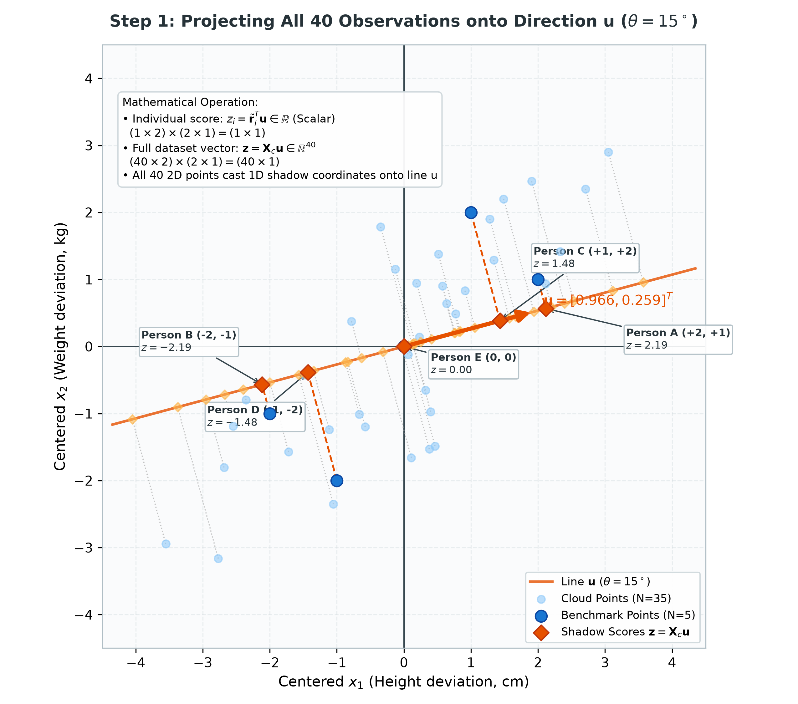

*Figure 3.3a: Step 1 of the Variance Machine — Projecting All 40 Observations onto Direction $\mathbf{u}_{2 \times 1}$ ($\theta = 15^\circ$). Each centered observation $\tilde{\mathbf{r}}_{i, 2 \times 1} \in \mathbb{R}^2$ drops perpendicularly onto line $\mathbf{u}_{2 \times 1}$, producing a 1D shadow coordinate $z_{i, 1 \times 1} = \tilde{\mathbf{r}}_{i, 1 \times 2}^T \mathbf{u}_{2 \times 1}$. Together, all 40 points form the score vector $\mathbf{z}_{40 \times 1} = (\mathbf{X}_c)_{40 \times 2} \mathbf{u}_{2 \times 1} \in \mathbb{R}^{40}$.*

👉 **[Open Interactive Figure 3.3a in Browser](https://thisispk48.github.io/workshops/20260926_sju_26bda_pca/assets/3_3_1_fig_step1_projection.html)**

</div>

---

#### Step 2: Calculating the Variance of the Shadows
First, what is the sample mean of the projected coordinates $\mathbf{z}_{40 \times 1}$?

$$\bar{z}_{1 \times 1} = \frac{1}{N} \sum_{i=1}^N z_{i, 1 \times 1} = \frac{1}{N} \sum_{i=1}^N (\tilde{\mathbf{r}}_{i, 1 \times 2}^T \mathbf{u}_{2 \times 1}) = \left( \frac{1}{N} \sum_{i=1}^N \tilde{\mathbf{r}}_{i, 2 \times 1} \right)^T \mathbf{u}_{2 \times 1} = \mathbf{0}_{1 \times 2}^T \mathbf{u}_{2 \times 1} = 0$$

Because our data was centered in Section 3.1, the average shadow coordinate is strictly zero ($\bar{z} = 0$).  
Therefore, the sample variance of $\mathbf{z}_{40 \times 1}$ is simply the average of the squared scores:

$$\text{Var}(\mathbf{z})_{1 \times 1} = \frac{1}{N - 1} \sum_{i=1}^N (z_i - \bar{z})^2 = \frac{1}{N - 1} \sum_{i=1}^N z_i^2 = \frac{1}{N - 1} \underbrace{\mathbf{z}_{1 \times 40}^T}_{1 \times 40} \, \underbrace{\mathbf{z}_{40 \times 1}}_{40 \times 1} = (1 \times 1) \text{ Scalar (Variance)}$$

For our test direction at $\theta = 15^\circ$, the sum of squared scores is $\mathbf{z}_{1 \times 40}^T \mathbf{z}_{40 \times 1} = 136.50$, yielding sample variance:

$$\text{Var}(\mathbf{z})_{1 \times 1} = \frac{136.50}{39} = \mathbf{3.50}$$

<div align="center">

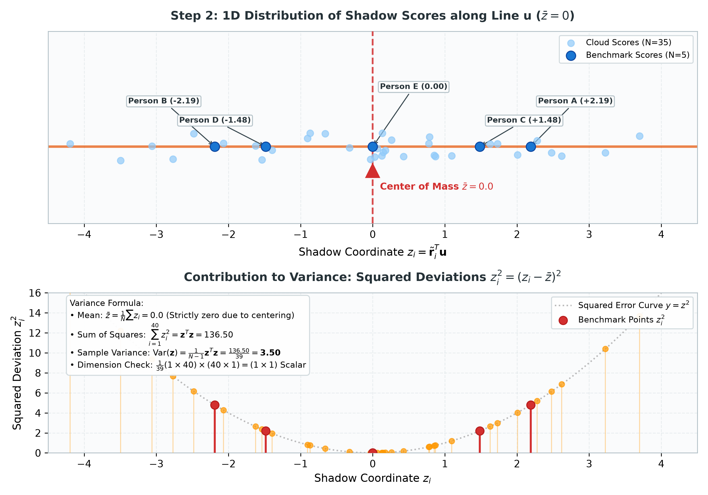

*Figure 3.3b: Step 2 of the Variance Machine — 1D Score Distribution and Squared Deviations along Line $\mathbf{u}_{2 \times 1}$. Top: The 40 shadow coordinates balance exactly at $\bar{z} = 0.0$ (guaranteed by centering). Bottom: Squared deviations $z_i^2 = (z_i - \bar{z})^2$ contribute to the total sum of squares $\mathbf{z}_{1 \times 40}^T \mathbf{z}_{40 \times 1} = 136.50$, yielding sample variance $\text{Var}(\mathbf{z})_{1 \times 1} = \frac{136.50}{39} = 3.50$.*

👉 **[Open Interactive Figure 3.3b in Browser](https://thisispk48.github.io/workshops/20260926_sju_26bda_pca/assets/3_3_2_fig_step2_variance.html)**

</div>

---

#### Step 3: The Matrix Substitution

**1. The General Formula for Variance of Any Centered Column Vector:**  
Recall from Section 1.1 (dot products as sum of squares) and Section 3.2 (feature variances) that for **any** centered column vector $\mathbf{w} \in \mathbb{R}^N$ with sample mean $\bar{w} = 0$, the sample variance is simply the sum of squared elements divided by $N - 1$:

$$\text{Var}(\mathbf{w})_{1 \times 1} = \frac{1}{N - 1} \sum_{i=1}^N w_i^2 = \frac{1}{N - 1} \underbrace{\mathbf{w}_{1 \times N}^T}_{1 \times N} \, \underbrace{\mathbf{w}_{N \times 1}}_{N \times 1} = (1 \times 1) \text{ Scalar}$$

**2. Generalizing to the Projected Score Vector ($\mathbf{w} = \mathbf{z} = \mathbf{X}_c \mathbf{u}$):**  
In Step 1, we found that our 1D shadow score vector is $\mathbf{z}_{40 \times 1} = (\mathbf{X}_c)_{40 \times 2} \, \mathbf{u}_{2 \times 1}$. Since centering guarantees that $\bar{z} = 0$ (proved in Step 2), we directly apply the general variance formula by substituting $\mathbf{w}_{40 \times 1} = (\mathbf{X}_c)_{40 \times 2} \, \mathbf{u}_{2 \times 1}$:

$$\text{Var}(\mathbf{z})_{1 \times 1} = \text{Var}((\mathbf{X}_c)_{40 \times 2} \mathbf{u}_{2 \times 1}) = \frac{1}{N - 1} \underbrace{\left((\mathbf{X}_c)_{40 \times 2} \mathbf{u}_{2 \times 1}\right)^T}_{1 \times 40} \, \underbrace{\left((\mathbf{X}_c)_{40 \times 2} \mathbf{u}_{2 \times 1}\right)}_{40 \times 1}$$

Apply the transpose rule $(\mathbf{A}\mathbf{B})^T = \mathbf{B}^T \mathbf{A}^T$:

$$\left((\mathbf{X}_c)_{40 \times 2} \mathbf{u}_{2 \times 1}\right)^T = \underbrace{\mathbf{u}_{1 \times 2}^T}_{1 \times 2} \, \underbrace{\mathbf{X}_{c, 2 \times 40}^T}_{2 \times 40} = (1 \times 40)$$

Substitute this back into the variance expression:

$$\text{Var}((\mathbf{X}_c)_{40 \times 2} \mathbf{u}_{2 \times 1})_{1 \times 1} = \frac{1}{N - 1} \underbrace{\mathbf{u}_{1 \times 2}^T}_{1 \times 2} \, \underbrace{\mathbf{X}_{c, 2 \times 40}^T}_{2 \times 40} \, \underbrace{(\mathbf{X}_c)_{40 \times 2}}_{40 \times 2} \, \underbrace{\mathbf{u}_{2 \times 1}}_{2 \times 1}$$

Regroup the scalar factor $\frac{1}{N - 1}$ with the center matrices:

$$\text{Var}((\mathbf{X}_c)_{40 \times 2} \mathbf{u}_{2 \times 1})_{1 \times 1} = \underbrace{\mathbf{u}_{1 \times 2}^T}_{1 \times 2} \underbrace{\left( \frac{1}{N - 1} \mathbf{X}_{c, 2 \times 40}^T (\mathbf{X}_c)_{40 \times 2} \right)}_{2 \times 2 \, (\mathbf{\Sigma}_{2 \times 2})} \underbrace{\mathbf{u}_{2 \times 1}}_{2 \times 1}$$

Notice that the grouped center term is literally the **Sample Covariance Matrix** $\mathbf{\Sigma}_{2 \times 2}$ from Section 3.2:

$$\text{Var}((\mathbf{X}_c)_{40 \times 2} \mathbf{u}_{2 \times 1})_{1 \times 1} = \underbrace{\mathbf{u}_{1 \times 2}^T}_{1 \times 2} \, \underbrace{\mathbf{\Sigma}_{2 \times 2}}_{2 \times 2} \, \underbrace{\mathbf{u}_{2 \times 1}}_{2 \times 1} = (1 \times 1) \text{ Scalar}$$

> **The Big Discovery:**  
> To calculate the variance of your data cloud along **any direction $\mathbf{u}_{2 \times 1}$ in the universe**, you do not need to project the raw points over and over again. You simply evaluate the compact quadratic form $\mathbf{u}_{1 \times 2}^T \mathbf{\Sigma}_{2 \times 2} \mathbf{u}_{2 \times 1}$!

<div align="center">

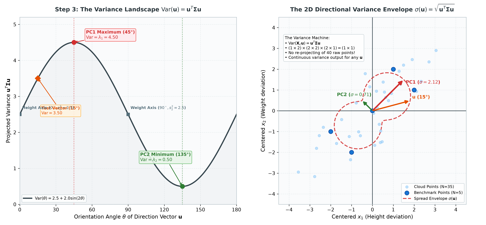

*Figure 3.3c: Step 3 of the Variance Machine — The Matrix Substitution $\text{Var}((\mathbf{X}_c)_{40 \times 2} \mathbf{u}_{2 \times 1}) = \mathbf{u}_{1 \times 2}^T \mathbf{\Sigma}_{2 \times 2} \mathbf{u}_{2 \times 1}$. Left: The continuous variance landscape across orientation angles $\theta \in [0^\circ, 180^\circ]$ peaking at $\theta = 45^\circ$ (PC1, $\lambda_1 = 4.50$) and bottoming at $\theta = 135^\circ$ (PC2, $\lambda_2 = 0.50$). Right: The 2D spread envelope $\sigma(\mathbf{u}) = \sqrt{\mathbf{u}_{1 \times 2}^T \mathbf{\Sigma}_{2 \times 2} \mathbf{u}_{2 \times 1}}$ showing that the compact $2 \times 2$ covariance matrix $\mathbf{\Sigma}_{2 \times 2}$ instantaneously predicts data spread in any direction without re-projecting the 40 raw points.*

👉 **[Open Interactive Figure 3.3c in Browser](https://thisispk48.github.io/workshops/20260926_sju_26bda_pca/assets/3_3_3_fig_step3_machine.html)**

</div>

---

### Step 4: The Ultimate Contrast (Worst Direction vs. Optimal Direction)

To see why maximizing variance is the defining principle of PCA, consider the two extreme directions revealed by our variance machine:
1. **The Worst Direction ($\mathbf{q}_{2, 2 \times 1}$ at $135^\circ$, PC2):** Variance collapses to its absolute minimum $\lambda_2 = 0.50$. Points collide and distinguishability is destroyed.
2. **The Optimal Direction ($\mathbf{q}_{1, 2 \times 1}$ at $45^\circ$, PC1):** Variance reaches its absolute maximum $\lambda_1 = 4.50$, cleanly separating individuals across an 8.8-unit span while preserving 90% of total information.

<div align="center">

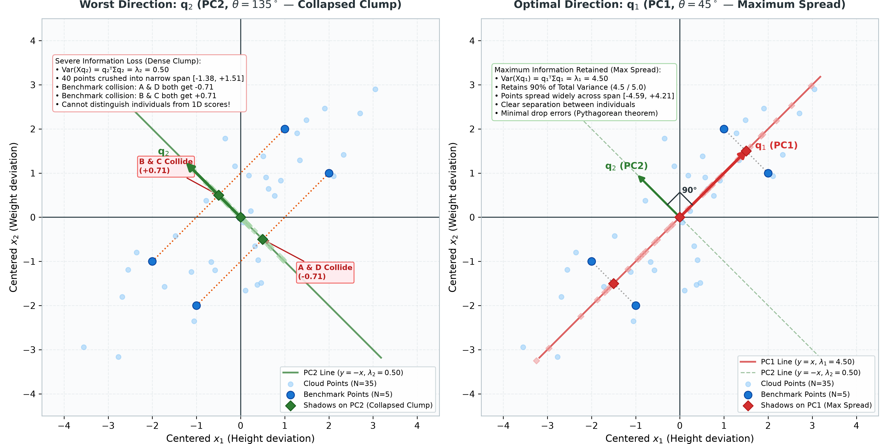

*Figure 3.3d: Why Maximize Variance? Worst Line (PC2 Clumping) vs. Best Line (PC1 Spread). Left: Projecting onto $\mathbf{q}_{2, 2 \times 1}$ (PC2, Green at $135^\circ$) collapses the 40 points into a dense clump ($\text{Var} = 0.50$), causing Person A and D to collide at $-0.71$, and Person B and C to collide at $+0.71$ (distinguishability destroyed with massive drop errors). Right: Projecting onto leading eigenvector $\mathbf{q}_{1, 2 \times 1}$ (PC1, Red at $45^\circ$) maximizes spread ($\text{Var} = \lambda_1 = 4.50$, retaining 90% of total variance), cleanly separating individuals across an 8.8-unit span with minimal drop errors.*

👉 **[Open Interactive Figure 3.3d in Browser](https://thisispk48.github.io/workshops/20260926_sju_26bda_pca/assets/3_3_fig_variance_direction.html)**

</div>

---

## 3.4 Finding the Optimal Direction: The Eigendecomposition of $\mathbf{\Sigma}$

Now we can state the mathematical optimization problem of PCA with total clarity:

$$\max_{\mathbf{u}_{2 \times 1}} \underbrace{\mathbf{u}_{1 \times 2}^T}_{1 \times 2} \, \underbrace{\mathbf{\Sigma}_{2 \times 2}}_{2 \times 2} \, \underbrace{\mathbf{u}_{2 \times 1}}_{2 \times 1} \quad \text{subject to } \underbrace{\mathbf{u}_{1 \times 2}^T}_{1 \times 2} \, \underbrace{\mathbf{u}_{2 \times 1}}_{2 \times 1} = 1$$

- **Why the constraint $\mathbf{u}_{1 \times 2}^T \mathbf{u}_{2 \times 1} = 1$?**  
  If there were no constraint on the length of $\mathbf{u}_{2 \times 1}$, one could make $\mathbf{u}_{1 \times 2}^T \mathbf{\Sigma}_{2 \times 2} \mathbf{u}_{2 \times 1}$ arbitrarily huge simply by making the vector longer (e.g. setting $\|\mathbf{u}\| = 1{,}000$). We are searching purely for the **best direction in space**, not the longest arrow. Constraining $\mathbf{u}_{2 \times 1}$ to unit length ensures we evaluate pure orientation.

---

### Step 1: The Lagrangian Function
To solve an optimization problem with a constraint, we combine the objective and the constraint into a single equation using a **Lagrange Multiplier** $\lambda$:

$$\mathcal{L}(\mathbf{u}_{2 \times 1}, \lambda) = \underbrace{\mathbf{u}_{1 \times 2}^T}_{1 \times 2} \, \underbrace{\mathbf{\Sigma}_{2 \times 2}}_{2 \times 2} \, \underbrace{\mathbf{u}_{2 \times 1}}_{2 \times 1} - \lambda (\underbrace{\mathbf{u}_{1 \times 2}^T}_{1 \times 2} \, \underbrace{\mathbf{u}_{2 \times 1}}_{2 \times 1} - 1)$$

Think of $\lambda$ as a penalty tax:
- If $\mathbf{u}_{2 \times 1}$ obeys the rule ($\mathbf{u}_{1 \times 2}^T \mathbf{u}_{2 \times 1} = 1$), then $(\mathbf{u}_{1 \times 2}^T \mathbf{u}_{2 \times 1} - 1) = 0$, the penalty drops to zero, and the score equals the pure variance.
- If $\mathbf{u}_{2 \times 1}$ exceeds unit length, the penalty kicks in and subtracts from the score.

---

### Step 2: Differentiating the Lagrangian (Setting the Gradient to Zero)

To find the optimal direction that maximizes variance, we take the gradient vector of partial derivatives with respect to $\mathbf{u}_{2 \times 1}$ and set it to the zero vector $\mathbf{0}_{2 \times 1}$:

$$\nabla_{\mathbf{u}} \mathcal{L} = \nabla_{\mathbf{u}} \left( \mathbf{u}_{1 \times 2}^T \mathbf{\Sigma}_{2 \times 2} \mathbf{u}_{2 \times 1} \right) - \nabla_{\mathbf{u}} \left[ \lambda (\mathbf{u}_{1 \times 2}^T \mathbf{u}_{2 \times 1} - 1) \right] = \mathbf{0}_{2 \times 1}$$

Where does this derivative come from? Let us derive each term component-by-component in $\mathbb{R}^2$ with standard calculus:

#### Part A: Differentiating the Quadratic Variance Term $\mathbf{u}^T \mathbf{\Sigma} \mathbf{u}$
Let the unit vector and symmetric covariance matrix be:

$$\mathbf{u}_{2 \times 1} = \begin{bmatrix} u_1 \\\\ u_2 \end{bmatrix}_{2 \times 1}, \qquad \mathbf{\Sigma}_{2 \times 2} = \begin{bmatrix} s_{11} & s_{12} \\\\ s_{21} & s_{22} \end{bmatrix}_{2 \times 2} \quad (\text{where } s_{12} = s_{21} \text{ due to symmetry})$$

1. First, multiply the matrix $\mathbf{\Sigma}_{2 \times 2}$ by vector $\mathbf{u}_{2 \times 1}$:

$$\mathbf{\Sigma} \mathbf{u} = \begin{bmatrix} s_{11} u_1 + s_{12} u_2 \\\\ s_{21} u_1 + s_{22} u_2 \end{bmatrix}_{2 \times 1}$$

2. Multiply on the left by row vector $\mathbf{u}_{1 \times 2}^T = [u_1, u_2]$:

$$\mathbf{u}^T \mathbf{\Sigma} \mathbf{u} = u_1 (s_{11} u_1 + s_{12} u_2) + u_2 (s_{21} u_1 + s_{22} u_2) = s_{11} u_1^2 + s_{12} u_1 u_2 + s_{21} u_1 u_2 + s_{22} u_2^2$$

   Because $\mathbf{\Sigma}$ is symmetric ($s_{12} = s_{21}$), the two cross terms combine:

$$\mathbf{u}^T \mathbf{\Sigma} \mathbf{u} = s_{11} u_1^2 + 2 s_{12} u_1 u_2 + s_{22} u_2^2$$

3. Take the partial derivative with respect to each component:
   - Partial derivative with respect to $u_1$:

$$\frac{\partial}{\partial u_1} (\mathbf{u}^T \mathbf{\Sigma} \mathbf{u}) = 2 s_{11} u_1 + 2 s_{12} u_2 + 0 = 2 (s_{11} u_1 + s_{12} u_2)$$

   - Partial derivative with respect to $u_2$:

$$\frac{\partial}{\partial u_2} (\mathbf{u}^T \mathbf{\Sigma} \mathbf{u}) = 0 + 2 s_{12} u_1 + 2 s_{22} u_2 = 2 (s_{21} u_1 + s_{22} u_2) \quad (\text{since } s_{12} = s_{21})$$

4. Stacking these two partial derivatives into the gradient vector:

$$\nabla_{\mathbf{u}} (\mathbf{u}^T \mathbf{\Sigma} \mathbf{u}) = \begin{bmatrix} \frac{\partial}{\partial u_1} \\\\ \frac{\partial}{\partial u_2} \end{bmatrix} = 2 \begin{bmatrix} s_{11} u_1 + s_{12} u_2 \\\\ s_{21} u_1 + s_{22} u_2 \end{bmatrix} = 2 \underbrace{\mathbf{\Sigma}_{2 \times 2}}_{2 \times 2} \, \underbrace{\mathbf{u}_{2 \times 1}}_{2 \times 1}$$

*(General Matrix Calculus Rule: For any symmetric matrix $\mathbf{A} = \mathbf{A}^T$, $\nabla_{\mathbf{u}} (\mathbf{u}^T \mathbf{A} \mathbf{u}) = (\mathbf{A} + \mathbf{A}^T)\mathbf{u} = 2\mathbf{A}\mathbf{u}$.)*

---

#### Part B: Differentiating the Constraint Term $\lambda (\mathbf{u}^T \mathbf{u} - 1)$
Since $\mathbf{u}^T \mathbf{u} = u_1^2 + u_2^2$:

$$\lambda (\mathbf{u}^T \mathbf{u} - 1) = \lambda (u_1^2 + u_2^2 - 1)$$

Taking partial derivatives with respect to $u_1$ and $u_2$:
- $\frac{\partial}{\partial u_1} [\lambda (u_1^2 + u_2^2 - 1)] = 2 \lambda u_1$
- $\frac{\partial}{\partial u_2} [\lambda (u_1^2 + u_2^2 - 1)] = 2 \lambda u_2$

Stacking into the gradient vector:

$$\nabla_{\mathbf{u}} [\lambda (\mathbf{u}^T \mathbf{u} - 1)] = 2 \lambda \begin{bmatrix} u_1 \\\\ u_2 \end{bmatrix} = 2 \lambda \underbrace{\mathbf{u}_{2 \times 1}}_{2 \times 1}$$

---

#### Part C: Combining Both Halves and Equating to Zero
Subtracting Part B from Part A gives the complete gradient:

$$\nabla_{\mathbf{u}} \mathcal{L} = 2 \underbrace{\mathbf{\Sigma}_{2 \times 2}}_{2 \times 2} \, \underbrace{\mathbf{u}_{2 \times 1}}_{2 \times 1} - 2 \lambda \underbrace{\mathbf{u}_{2 \times 1}}_{2 \times 1} = \mathbf{0}_{2 \times 1}$$

Divide both sides by $2$:

$$\underbrace{\mathbf{\Sigma}_{2 \times 2}}_{2 \times 2} \, \underbrace{\mathbf{u}_{2 \times 1}}_{2 \times 1} - \lambda \underbrace{\mathbf{u}_{2 \times 1}}_{2 \times 1} = \mathbf{0}_{2 \times 1} \implies \underbrace{\mathbf{\Sigma}_{2 \times 2}}_{2 \times 2} \, \underbrace{\mathbf{u}_{2 \times 1}}_{2 \times 1} = \lambda \underbrace{\mathbf{u}_{2 \times 1}}_{2 \times 1}$$

> **The Eureka Moment of PCA:**  
> Look at the equation that emerged: $\mathbf{\Sigma}_{2 \times 2} \mathbf{u}_{2 \times 1} = \lambda \mathbf{u}_{2 \times 1}$.  
> This **IS the exact Eigenvalue Equation from Section 2.3!**  
> The direction of maximum variance $\mathbf{u}_{2 \times 1}$ is an **Eigenvector** of the Covariance Matrix $\mathbf{\Sigma}_{2 \times 2}$!

---

### Step 3: What is the Variance Captured?
Multiply both sides of $\mathbf{\Sigma}_{2 \times 2} \mathbf{u}_{2 \times 1} = \lambda \mathbf{u}_{2 \times 1}$ on the left by $\mathbf{u}_{1 \times 2}^T$:

$$\underbrace{\mathbf{u}_{1 \times 2}^T}_{1 \times 2} \, \underbrace{\mathbf{\Sigma}_{2 \times 2}}_{2 \times 2} \, \underbrace{\mathbf{u}_{2 \times 1}}_{2 \times 1} = \underbrace{\mathbf{u}_{1 \times 2}^T}_{1 \times 2} (\lambda \mathbf{u}_{2 \times 1}) = \lambda (\underbrace{\mathbf{u}_{1 \times 2}^T}_{1 \times 2} \, \underbrace{\mathbf{u}_{2 \times 1}}_{2 \times 1})$$

Since $\mathbf{u}_{2 \times 1}$ is a unit vector ($\mathbf{u}_{1 \times 2}^T \mathbf{u}_{2 \times 1} = 1$):

$$\text{Var}(\text{Projected Data})_{1 \times 1} = \underbrace{\mathbf{u}_{1 \times 2}^T}_{1 \times 2} \, \underbrace{\mathbf{\Sigma}_{2 \times 2}}_{2 \times 2} \, \underbrace{\mathbf{u}_{2 \times 1}}_{2 \times 1} = \lambda$$

- **The Grand Result:**  
  1. The variance captured along an eigenvector **is exactly equal to its eigenvalue $\lambda$**!
  2. To **maximize** the variance, we choose the eigenvector $\mathbf{q}_{1, 2 \times 1}$ corresponding to the **largest eigenvalue $\lambda_1$**. This is the **First Principal Component (PC1)**.
  3. The **Second Principal Component (PC2)** is the eigenvector $\mathbf{q}_{2, 2 \times 1}$ corresponding to the second eigenvalue $\lambda_2$. By Section 2.5 and 2.6, it is **strictly orthogonal ($90^\circ$)** to PC1 and captures the next largest variance $\lambda_2$.

---

## 3.5 Solving PCA Across the Three Simulated Cases (Seeing the Spine Tilt)

Now let's apply this exact mathematical pipeline to our three simulated datasets ($N = 40$ points each).

Notice the incredible power of linear algebra:  
Although each dataset contains 40 observations, **$\mathbf{\Sigma}_{2 \times 2}$ is always a compact $2 \times 2$ matrix**. We can solve PCA completely by hand!

---

### Case 1: Positive Covariance (Height vs. Weight)
Our positive covariance matrix was:

$$\mathbf{\Sigma}_{1, 2 \times 2} = \begin{bmatrix} 2.5 & 2.0 \\\\ 2.0 & 2.5 \end{bmatrix}_{2 \times 2}$$

Using the trace-determinant formula from Section 2.4:
1. $\text{Tr}(\mathbf{\Sigma}_{1, 2 \times 2}) = 2.5 + 2.5 = 5.0$
2. $\det(\mathbf{\Sigma}_{1, 2 \times 2}) = (2.5)(2.5) - (2.0)(2.0) = 6.25 - 4.0 = 2.25$

$$\lambda^2 - 5.0\lambda + 2.25 = 0 \implies (\lambda - 4.5)(\lambda - 0.5) = 0$$

$$\lambda_1 = 4.50, \qquad \lambda_2 = 0.50$$

The unit eigenvectors are vectors $\mathbf{q}_1, \mathbf{q}_2 \in \mathbb{R}^2$:

$$\mathbf{q}_{1, 2 \times 1} = \frac{1}{\sqrt{2}}\begin{bmatrix} 1 \\\\ 1 \end{bmatrix}_{2 \times 1} \quad (\text{PC1, Red at } 45^\circ), \qquad \mathbf{q}_{2, 2 \times 1} = \frac{1}{\sqrt{2}}\begin{bmatrix} -1 \\\\ 1 \end{bmatrix}_{2 \times 1} \quad (\text{PC2, Green at } 135^\circ)$$

- **Total Variance:** $\text{Tr}(\mathbf{\Sigma}_{1, 2 \times 2}) = \lambda_1 + \lambda_2 = 4.50 + 0.50 = 5.00$
- **Explained Variance Ratio for PC1:**

$$\frac{\lambda_1}{\lambda_1 + \lambda_2} = \frac{4.50}{5.00} = 0.90$$

  Compressing along PC1 captures **90.0%** of total variance.
- **The Story:** The data cloud tilts upward to the right along $y = x$. Compressing 2D down to 1D along PC1 retains **90% of all information** across all 40 people!

---

### Case 2: Negative Covariance (Elevation vs. Temperature)
Our negative covariance matrix was:

$$\mathbf{\Sigma}_{2, 2 \times 2} = \begin{bmatrix} 2.5 & -2.0 \\\\ -2.0 & 2.5 \end{bmatrix}_{2 \times 2}$$

1. $\text{Tr}(\mathbf{\Sigma}_{2, 2 \times 2}) = 5.0, \quad \det(\mathbf{\Sigma}_{2, 2 \times 2}) = 2.25$
2. Eigenvalues: $\lambda_1 = 4.50, \quad \lambda_2 = 0.50$
3. The unit eigenvectors are vectors $\mathbf{q}_1, \mathbf{q}_2 \in \mathbb{R}^2$:

$$\mathbf{q}_{1, 2 \times 1} = \frac{1}{\sqrt{2}}\begin{bmatrix} 1 \\\\ -1 \end{bmatrix}_{2 \times 1} \quad (\text{PC1, Red at } -45^\circ), \qquad \mathbf{q}_{2, 2 \times 1} = \frac{1}{\sqrt{2}}\begin{bmatrix} 1 \\\\ 1 \end{bmatrix}_{2 \times 1} \quad (\text{PC2, Green at } 45^\circ)$$

- **Explained Variance Ratio for PC1:** $\frac{4.50}{5.00} = 0.90$ (**90.0%**)
- **The Story:** The negative covariance tilted the spine by $90^\circ$! The dominant line of spread now slopes downward along $y = -x$.

---

### Case 3: Zero Covariance (Height vs. Shoe Brand / Uncorrelated)
Our zero covariance matrix was:

$$\mathbf{\Sigma}_{3, 2 \times 2} = \begin{bmatrix} 2.0 & 0.0 \\\\ 0.0 & 2.0 \end{bmatrix}_{2 \times 2}$$

1. This matrix is already diagonal!
2. Eigenvalues: $\lambda_1 = 2.00, \quad \lambda_2 = 2.00$
3. Eigenvectors: Any pair of perpendicular unit vectors in $\mathbb{R}^2$ (e.g. standard axes $\mathbf{e}_{1, 2 \times 1} = [1, 0]^T$ and $\mathbf{e}_{2, 2 \times 1} = [0, 1]^T$).
- **Explained Variance Ratio:** $\frac{2.00}{4.00} = 0.50$ (**50.0%**)
- **The Story:** Both eigenvalues are identical! The cloud is circular, with equal spread in every direction. **There is no single dominant spine in uncorrelated data.**

<div align="center">

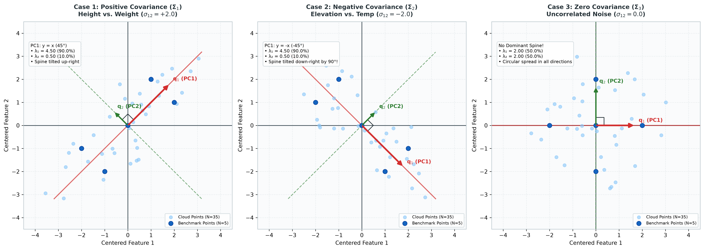

*Figure 3.5: Principal Components Across the Three Covariance Cases (N=40 each). Panel 1: Positive Covariance (PC1 tilts up-right at $45^\circ$, capturing 90.0%). Panel 2: Negative Covariance (PC1 tilts down-right at $-45^\circ$, capturing 90.0%). Panel 3: Zero Covariance (Equal eigenvalues $\lambda_1 = \lambda_2 = 2.00$, circular spread with no preferred spine).*

👉 **[Open Interactive Figure 3.5 in Browser](https://thisispk48.github.io/workshops/20260926_sju_26bda_pca/assets/3_5_fig_pca_cases.html)**

</div>

---

## 3.6 Dimensionality Reduction: 1D Compression & 2D Reconstruction

Now let's see how PCA performs compression and decompression on our benchmark dataset (Case 1: Height vs. Weight).

### Step 1: 1D Compression (Computing Principal Component Scores)
To compress each centered observation vector $\tilde{\mathbf{r}}_{i, 2 \times 1} \in \mathbb{R}^2$ down to a single 1D number $z_{i, 1 \times 1} \in \mathbb{R}$, we project it onto the unit PC1 direction vector $\mathbf{q}_{1, 2 \times 1} \in \mathbb{R}^2$ ($\mathbf{q}_{1, 2 \times 1} = \frac{1}{\sqrt{2}}[1, 1]^T$):

$$z_{i, 1 \times 1} = \underbrace{\tilde{\mathbf{r}}_{i, 1 \times 2}^T}_{1 \times 2} \, \underbrace{\mathbf{q}_{1, 2 \times 1}}_{2 \times 1} = \frac{\tilde{r}_{i1} + \tilde{r}_{i2}}{\sqrt{2}}$$

Let's compute the 1D scores for our benchmark individuals:
- **Person A** $(+2, +1) \implies z_A = \frac{2 + 1}{\sqrt{2}} = \frac{3}{\sqrt{2}} \approx \mathbf{+2.12}$
- **Person B** $(-2, -1) \implies z_B = \frac{-2 - 1}{\sqrt{2}} = \frac{-3}{\sqrt{2}} \approx \mathbf{-2.12}$
- **Person C** $(+1, +2) \implies z_C = \frac{1 + 2}{\sqrt{2}} = \frac{3}{\sqrt{2}} \approx \mathbf{+2.12}$
- **Person D** $(-1, -2) \implies z_D = \frac{-1 - 2}{\sqrt{2}} = \frac{-3}{\sqrt{2}} \approx \mathbf{-2.12}$
- **Person E** $(0, 0) \implies z_E = \mathbf{0.00}$

---

### Step 2: 2D Reconstruction (Decompressing Back to Original Space)
To decompress a 1D score $z_{i, 1 \times 1}$ back into a 2D centered observation vector in $\mathbb{R}^2$, we multiply the scalar score by the PC1 direction vector $\mathbf{q}_{1, 2 \times 1} \in \mathbb{R}^2$:

$$\hat{\mathbf{r}}_{i, 2 \times 1} = z_{i, 1 \times 1} \, (\mathbf{q}_1)_{2 \times 1} = (\underbrace{\tilde{\mathbf{r}}_{i, 1 \times 2}^T}_{1 \times 2} \, \underbrace{\mathbf{q}_{1, 2 \times 1}}_{2 \times 1}) (\mathbf{q}_1)_{2 \times 1} = \underbrace{(\mathbf{q}_{1, 2 \times 1} \mathbf{q}_{1, 1 \times 2}^T)}_{2 \times 2} \, \underbrace{\tilde{\mathbf{r}}_{i, 2 \times 1}}_{2 \times 1} \in \mathbb{R}^2$$

For **Person A**:

$$\hat{\mathbf{r}}_{A, 2 \times 1} = \frac{3}{\sqrt{2}} \left( \frac{1}{\sqrt{2}} \begin{bmatrix} 1 \\\\ 1 \end{bmatrix}_{2 \times 1} \right) = \begin{bmatrix} 1.5 \\\\ 1.5 \end{bmatrix}_{2 \times 1}$$

---

### Step 3: The Reconstruction Error Vector
How much information did we lose by compressing Person A from 2D down to 1D?  
The difference between the original centered point and the reconstructed point is the **perpendicular error vector**:

$$\mathbf{e}_{i, 2 \times 1} = \tilde{\mathbf{r}}_{i, 2 \times 1} - \hat{\mathbf{r}}_{i, 2 \times 1}$$

For **Person A**:

$$\mathbf{e}_{A, 2 \times 1} = \begin{bmatrix} 2 \\\\ 1 \end{bmatrix}_{2 \times 1} - \begin{bmatrix} 1.5 \\\\ 1.5 \end{bmatrix}_{2 \times 1} = \begin{bmatrix} 0.5 \\\\ -0.5 \end{bmatrix}_{2 \times 1}$$

Notice that $\mathbf{e}_{A, 2 \times 1}$ points in direction $[1, -1]^T$—it lies **strictly along the dropped PC2 axis $\mathbf{q}_{2, 2 \times 1}$**!

---

### The Master PCA Verification Table

The table below shows the complete compression, reconstruction, and error metrics for our benchmark individuals, followed by the summary totals across the entire **$N = 40$ point cloud**:

| Individual | Centered Point $\tilde{\mathbf{r}}_i$ | Original Energy $\Vert\tilde{\mathbf{r}}_i\Vert^2$ | 1D Score $z_i = \tilde{\mathbf{r}}_i^T \mathbf{q}_1$ | Shadow Energy $z_i^2$ | Reconstructed Point $\hat{\mathbf{r}}_i$ | Error Vector $\mathbf{e}_i$ | Error Energy $\Vert\mathbf{e}_i\Vert^2$ | Pythagoras Check |
| :---: | :---: | :---: | :---: | :---: | :---: | :---: | :---: | :---: |
| **Person A** | $[+2, +1]^T$ | $4 + 1 = \mathbf{5.0}$ | $+3/\sqrt{2} \approx +2.12$ | $\mathbf{4.5}$ | $[+1.5, +1.5]^T$ | $[+0.5, -0.5]^T$ | $0.25 + 0.25 = \mathbf{0.5}$ | $4.5 + 0.5 = \mathbf{5.0}$ |
| **Person B** | $[-2, -1]^T$ | $4 + 1 = \mathbf{5.0}$ | $-3/\sqrt{2} \approx -2.12$ | $\mathbf{4.5}$ | $[-1.5, -1.5]^T$ | $[-0.5, +0.5]^T$ | $0.25 + 0.25 = \mathbf{0.5}$ | $4.5 + 0.5 = \mathbf{5.0}$ |
| **Person C** | $[+1, +2]^T$ | $1 + 4 = \mathbf{5.0}$ | $+3/\sqrt{2} \approx +2.12$ | $\mathbf{4.5}$ | $[+1.5, +1.5]^T$ | $[-0.5, +0.5]^T$ | $0.25 + 0.25 = \mathbf{0.5}$ | $4.5 + 0.5 = \mathbf{5.0}$ |
| **Person D** | $[-1, -2]^T$ | $1 + 4 = \mathbf{5.0}$ | $-3/\sqrt{2} \approx -2.12$ | $\mathbf{4.5}$ | $[-1.5, -1.5]^T$ | $[+0.5, -0.5]^T$ | $0.25 + 0.25 = \mathbf{0.5}$ | $4.5 + 0.5 = \mathbf{5.0}$ |
| **Person E** | $[0, 0]^T$ | $0 + 0 = \mathbf{0.0}$ | $0.00$ | $\mathbf{0.0}$ | $[0.0, 0.0]^T$ | $[0.0, 0.0]^T$ | $0.00 + 0.00 = \mathbf{0.0}$ | $0.0 + 0.0 = \mathbf{0.0}$ |
| **Summary (All $N=40$)** | $\frac{1}{N-1}\sum$ | $\text{Tr}(\mathbf{\Sigma}_{1, 2 \times 2}) = \mathbf{5.00}$ | $\text{Mean} = 0$ | $\lambda_1 = \mathbf{4.50}$ (90%) | - | - | $\lambda_2 = \mathbf{0.50}$ (10%) | $\mathbf{4.50 + 0.50 = 5.00}$ |

<div align="center">

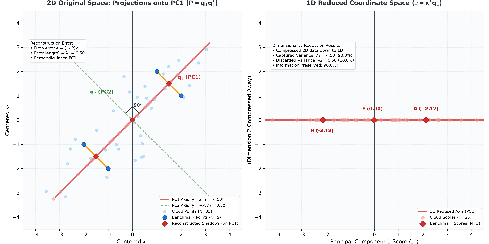

*Figure 3.4: PCA Dimensionality Reduction & Information Retention. Left: 2D original space showing 40 observations projected onto PC1 (Red), with orange error drop lines along PC2. Right: 1D compressed coordinate line retaining 90.0% of total variance.*

👉 **[Open Interactive Figure 3.4 in Browser](https://thisispk48.github.io/workshops/20260926_sju_26bda_pca/assets/3_4_fig_pca_reduction.html)**

</div>

---

## 3.7 Connecting the Dots: Three Foundational Insights

Now that the complete PCA pipeline has been established, we can unite everything into three clean, powerful insights:

### Insight 1: The Pythagoras Bridge (Variance Maximization = Error Minimization)
For every individual centered point in the dataset, the original deviation vector $\tilde{\mathbf{r}}_{i, 2 \times 1}$, projected shadow $\hat{\mathbf{r}}_{i, 2 \times 1}$, and error drop line $\mathbf{e}_{i, 2 \times 1}$ form a right triangle:

$$\|\tilde{\mathbf{r}}_{i, 2 \times 1}\|^2 = \|\hat{\mathbf{r}}_{i, 2 \times 1}\|^2 + \|\mathbf{e}_{i, 2 \times 1}\|^2$$

Summing across all $N = 40$ points and dividing by $(N - 1) = 39$:

$$\frac{1}{N - 1}\sum_{i=1}^N \|\tilde{\mathbf{r}}_{i, 2 \times 1}\|^2 = \frac{1}{N - 1}\sum_{i=1}^N \|\hat{\mathbf{r}}_{i, 2 \times 1}\|^2 + \frac{1}{N - 1}\sum_{i=1}^N \|\mathbf{e}_{i, 2 \times 1}\|^2$$

$$\text{Total Sample Variance} = \text{Captured PC1 Variance } (\lambda_1 = 4.50) + \text{Reconstruction Error Variance } (\lambda_2 = 0.50) = 5.00$$

Because the centered data cloud is fixed, **Total Sample Variance is a constant** ($\text{Tr}(\mathbf{\Sigma}_{2 \times 2}) = 5.00$).  
Therefore:
> **Maximizing projected variance automatically minimizes reconstruction error!**  
> Finding the line of widest spread is mathematically identical to finding the line of least information loss.

---

### Insight 2: The PCA Projection Operator (Connecting to Part 1)
From Section 1.6, an orthogonal projection matrix must satisfy $\mathbf{P}^2 = \mathbf{P}$ and $\mathbf{P}^T = \mathbf{P}$.  
The PCA reconstruction operator is:

$$\mathbf{P}_{\text{PCA}, 2 \times 2} = \underbrace{\mathbf{q}_{1, 2 \times 1}}_{2 \times 1} \, \underbrace{\mathbf{q}_{1, 1 \times 2}^T}_{1 \times 2}$$

$$\mathbf{P}_{\text{PCA}, 2 \times 2}^T = (\mathbf{q}_{1, 2 \times 1} \mathbf{q}_{1, 1 \times 2}^T)^T = \mathbf{q}_{1, 2 \times 1} \mathbf{q}_{1, 1 \times 2}^T = \mathbf{P}_{\text{PCA}, 2 \times 2}$$

$$\mathbf{P}_{\text{PCA}, 2 \times 2}^2 = (\mathbf{q}_{1, 2 \times 1} \mathbf{q}_{1, 1 \times 2}^T)(\mathbf{q}_{1, 2 \times 1} \mathbf{q}_{1, 1 \times 2}^T) = \underbrace{\mathbf{q}_{1, 2 \times 1}}_{2 \times 1} \, \underbrace{(\mathbf{q}_{1, 1 \times 2}^T \mathbf{q}_{1, 2 \times 1})}_{1 \times 1} \, \underbrace{\mathbf{q}_{1, 1 \times 2}^T}_{1 \times 2} = \mathbf{q}_{1, 2 \times 1} (1) \mathbf{q}_{1, 1 \times 2}^T = \mathbf{P}_{\text{PCA}, 2 \times 2}$$

$\mathbf{P}_{\text{PCA}, 2 \times 2}$ **IS an exact orthogonal projection matrix!** It drops high-dimensional centered observations directly onto the optimal principal component subspace.

---

### Insight 3: The Positive Semi-Definite Guarantee (Connecting to Part 2)
Why are eigenvalues of a covariance matrix guaranteed to be non-negative ($\lambda_i \ge 0$)?  
Because variance along any direction is an average of squared distances:

$$\text{Var}((\mathbf{X}_c)_{40 \times 2} \mathbf{u}_{2 \times 1})_{1 \times 1} = \underbrace{\mathbf{u}_{1 \times 2}^T}_{1 \times 2} \, \underbrace{\mathbf{\Sigma}_{2 \times 2}}_{2 \times 2} \, \underbrace{\mathbf{u}_{2 \times 1}}_{2 \times 1} = \frac{1}{N - 1} \sum_{i=1}^N z_i^2 = \frac{1}{N - 1} \underbrace{\mathbf{z}_{1 \times 40}^T}_{1 \times 40} \underbrace{\mathbf{z}_{40 \times 1}}_{40 \times 1} \ge 0$$

In linear algebra, a matrix satisfying $\mathbf{u}_{1 \times 2}^T \mathbf{\Sigma}_{2 \times 2} \mathbf{u}_{2 \times 1} \ge 0$ for all $\mathbf{u}_{2 \times 1}$ is called **Positive Semi-Definite (PSD)**.  
- The statistical law that *variance cannot be negative* is the exact physical twin of the linear algebra property that *$\mathbf{\Sigma}_{2 \times 2}$ is Positive Semi-Definite*.
- If an eigenvalue equals zero ($\lambda = 0$), the variance along that axis is literally zero (data points lie perfectly flat on a lower-dimensional line or plane). Dropping that dimension loses **0%** information!

---

### Summary Checklist of Part 3:
1. **Centering:** $(\mathbf{X}_c)_{40 \times 2} = \mathbf{X}_{40 \times 2} - \mathbf{1}_{40 \times 1} \mathbf{\mu}_{1 \times 2}^T$ anchors the center of mass at $(0, 0)$ so linear operators act purely on variation.
2. **Covariance:** $\mathbf{\Sigma}_{2 \times 2} = \frac{1}{N-1}(\mathbf{X}_c^T)_{2 \times 40} (\mathbf{X}_c)_{40 \times 2}$ captures all feature variances on the diagonal and pairwise covariances off the diagonal.
3. **The Variance Machine:** $\text{Var}((\mathbf{X}_c)_{40 \times 2} \mathbf{u}_{2 \times 1})_{1 \times 1} = \mathbf{u}_{1 \times 2}^T \mathbf{\Sigma}_{2 \times 2} \mathbf{u}_{2 \times 1}$ computes the spread along any unit direction $\mathbf{u}_{2 \times 1}$.
4. **Eigendecomposition:** Maximizing $\mathbf{u}_{1 \times 2}^T \mathbf{\Sigma}_{2 \times 2} \mathbf{u}_{2 \times 1}$ subject to $\|\mathbf{u}\| = 1$ leads directly to $\mathbf{\Sigma}_{2 \times 2}\mathbf{u}_{2 \times 1} = \lambda\mathbf{u}_{2 \times 1}$.
5. **Principal Components:** PC1 is the leading eigenvector $\mathbf{q}_{1, 2 \times 1}$ capturing maximum variance $\lambda_1$; PC2 is the orthogonal eigenvector $\mathbf{q}_{2, 2 \times 1}$ capturing $\lambda_2$.
6. **Information Conservation:** $\text{Total Variance} = \text{Tr}(\mathbf{\Sigma}_{2 \times 2}) = \sum \lambda_i = \text{Captured Variance} + \text{Reconstruction Error}$.

---

# Part 4: The Visual Capstone — Image Compression via Principal Component Analysis

In Parts 1 through 3, we built the complete mathematical foundation of Principal Component Analysis:
- **Part 1:** How orthogonal projections flatten vectors onto directional subspaces.
- **Part 2:** Why symmetric matrices guarantee strictly orthogonal, real eigenvectors.
- **Part 3:** How maximizing variance from the sample covariance matrix reveals the natural spine of data.

Now, in Part 4, we bring all three pillars together for the ultimate visual capstone of this workshop: **compressing a real-world digital image using PCA**, implementing it from first principles in pure NumPy, validating it against industry-standard Scikit-Learn, and mathematically proving **pixel-to-pixel parity**.

---

## 4.1 Images as High-Dimensional Data Matrices

A digital grayscale photograph is not merely a picture—in linear algebra, **an image is a matrix**.

Consider Leonardo da Vinci’s **Mona Lisa**, represented as an $H \times W$ grayscale image matrix:

$$\mathbf{X}_{H \times W} \in \mathbb{R}^{512 \times 512} \quad (H = 512 \text{ rows}, \quad W = 512 \text{ columns})$$

$$\mathbf{X}_{512 \times 512} = \begin{bmatrix} (\mathbf{r}_1^T)_{1 \times 512} \\\\ (\mathbf{r}_2^T)_{1 \times 512} \\\\ \vdots \\\\ (\mathbf{r}_{512}^T)_{1 \times 512} \end{bmatrix}_{512 \times 512} = \begin{bmatrix} x_{1,1} & x_{1,2} & \cdots & x_{1,512} \\\\ x_{2,1} & x_{2,2} & \cdots & x_{2,512} \\\\ \vdots & \vdots & \ddots & \vdots \\\\ x_{512,1} & x_{512,2} & \cdots & x_{512,512} \end{bmatrix}$$

Each pixel intensity is an 8-bit integer in $[0, 255]$:
- $0 \implies$ Pure Black
- $255 \implies$ Pure White

### The Geometric Interpretation for PCA:
Just like our height-weight dataset in Section 3.1:
- **Number of Observations ($N = H = 512$):** Every horizontal row is an individual observation vector in $\mathbb{R}^{512}$.
- **Number of Features ($D = W = 512$):** Every vertical column is a physical coordinate across the horizontal scanline.
- **Total Uncompressed Storage:** $512 \times 512 = \mathbf{262{,}144 \text{ numbers}}$ (floating-point pixel values).

---

### Step 1: Centering the Image Matrix

Before performing PCA, we compute the sample average intensity across all rows for each column:

$$\mathbf{\mu}_{1 \times W}^T = \frac{1}{H} \sum_{i=1}^H \mathbf{r}_{i, 1 \times W}^T = \frac{1}{H} \mathbf{1}_{1 \times H}^T \mathbf{X}_{H \times W} \in \mathbb{R}^{1 \times 512}$$

Physical meaning: $\mathbf{\mu}_{1 \times 512}^T$ represents the "average horizontal lighting slice" across the entire portrait.

Subtracting $\mathbf{\mu}$ from every row anchors the center of mass at the origin:

$$(\mathbf{X}_c)_{H \times W} = \mathbf{X}_{H \times W} - \mathbf{1}_{H \times 1} \mathbf{\mu}_{1 \times W}^T \in \mathbb{R}^{512 \times 512}$$

---

## 4.2 The Compression Mathematics (Rank-$k$ Low-Dimensional Projection)

Just as in Section 3.3, we want to compress our 512-dimensional scanline vectors down onto a compact subspace of $k$ principal component eigenvectors ($k \ll 512$).

### Step 2: Extracting the Top $k$ Principal Components
Using the Singular Value Decomposition (SVD) of the centered image matrix:

$$(\mathbf{X}_c)_{H \times W} = \mathbf{U}_{H \times H} \, \mathbf{S}_{H \times W} \, \mathbf{V}_{W \times W}^T$$

The columns of $\mathbf{V}_{W \times W}$ are the orthonormal eigenvectors of the feature covariance matrix $\mathbf{\Sigma} = \frac{1}{H - 1}\mathbf{X}_c^T \mathbf{X}_c$.

We select the leading $k$ columns of $\mathbf{V}$ corresponding to the $k$ largest singular values:

$$(\mathbf{V}_k)_{W \times k} = \begin{bmatrix} (\mathbf{q}_1)_{W \times 1} & (\mathbf{q}_2)_{W \times 1} & \cdots & (\mathbf{q}_k)_{W \times 1} \end{bmatrix}_{512 \times k}$$

---

### Step 3: 1D Compression (Projection into $k$-Dimensional Latent Space)
To compress the entire 512-column image down to just $k$ numbers per row, we project $(\mathbf{X}_c)_{H \times W}$ onto $(\mathbf{V}_k)_{W \times k}$:

$$\mathbf{Z}_{H \times k} = (\mathbf{X}_c)_{H \times W} \, (\mathbf{V}_k)_{W \times k} \in \mathbb{R}^{512 \times k}$$

- **Dimension Check:** $(512 \times 512) \times (512 \times k) = (512 \times k)$.
- **Storage Breakthrough:** Instead of storing 512 numbers per row, we now store only **$k$ shadow coordinates** per row!

---

### Step 4: 2D Reconstruction (Decompressing Back to Full Pixel Space)
To view the compressed image, we decompress the low-dimensional scores $\mathbf{Z}_{H \times k}$ back into original pixel space by multiplying by the transposed principal axes $(\mathbf{V}_k^T)_{k \times W}$ and re-adding the mean row $\mathbf{\mu}_{1 \times W}^T$:

$$\hat{\mathbf{X}}_{H \times W} = \underbrace{\mathbf{Z}_{H \times k}}_{512 \times k} \, \underbrace{(\mathbf{V}_k^T)_{k \times W}}_{k \times 512} + \underbrace{\mathbf{1}_{H \times 1} \mathbf{\mu}_{1 \times W}^T}_{512 \times 512} \in \mathbb{R}^{512 \times 512}$$

Substituting $\mathbf{Z} = \mathbf{X}_c \mathbf{V}_k$ reveals the exact **Rank-$k$ Projection Operator**:

$$\hat{\mathbf{X}} = (\mathbf{X}_c)_{H \times W} \underbrace{(\mathbf{V}_k \mathbf{V}_k^T)}_{W \times W \, (\mathbf{P}_k)} + \mathbf{1}_{H \times 1} \mathbf{\mu}^T$$

Notice that $\mathbf{P}_k = \mathbf{V}_k \mathbf{V}_k^T = \sum_{j=1}^k \mathbf{q}_j \mathbf{q}_j^T$ is literally the multi-dimensional orthogonal projection matrix from Section 1.6!

---

### The Storage Accounting: How Much Space Did We Save?

To transmit or store the compressed image on disk, we only need to save:
1. The compressed score matrix: $\mathbf{Z}_{H \times k} \implies H \times k$ numbers
2. The principal component basis matrix: $\mathbf{V}_{k, W \times k} \implies k \times W$ numbers
3. The mean vector: $\mathbf{\mu}_{1 \times W} \implies W$ numbers

$$\text{Total Numbers Stored} = (H \cdot k) + (k \cdot W) + W$$

$$\text{Storage Savings Ratio} = 1 - \frac{(H \cdot k) + (k \cdot W) + W}{H \cdot W}$$

Multiplying this ratio by $100$ yields the percentage of storage space saved:

$$\text{Storage Savings Percentage} = \text{Storage Savings Ratio} \times 100$$

#### The Compression vs. Information Retention Table (Mona Lisa, $512 \times 512$):

| Rank $k$ | Stored Numbers | Original Numbers | Storage Saved (%) | Explained Variance (%) | Reconstruction RMSE | Visual Quality |
| :---: | :---: | :---: | :---: | :---: | :---: | :--- |
| **Original** | $262{,}144$ | $262{,}144$ | **0.00%** (Baseline) | **100.00%** | $0.00$ | Perfect Masterpiece |
| **$k = 5$** | $5{,}632$ | $262{,}144$ | **97.85%** | **89.48%** | $16.76$ | Coarse lighting & head silhouette |
| **$k = 20$** | $20{,}992$ | $262{,}144$ | **91.99%** | **96.91%** | $9.10$ | Face, smile, veil, hands clearly identifiable |
| **$k = 50$** | $51{,}712$ | $262{,}144$ | **80.27%** | **98.47%** | $6.41$ | High-frequency landscape & fabric textures emerge |
| **$k = 100$** | $102{,}912$ | $262{,}144$ | **60.74%** | **99.25%** | $4.49$ | Visually indistinguishable from original |

---

## 4.3 Multi-Panel Visual Evidence

The two figures below show the complete visual progression of compressing the Mona Lisa across $k = 5, 20, 50, 100$ components, accompanied by the cumulative explained variance spectrum.

### 1. Pure NumPy First-Principles Implementation:

<div align="center">


*Figure 4.1: First-Principles PCA Image Compression (Pure NumPy). Top-left: Original 512x512 image. Panels 2-5: Reconstructed images at rank $k = 5, 20, 50, 100$, displaying variance captured, storage savings percentage, and RMSE. Bottom-right: The cumulative explained variance curve illustrating the rapid "elbow" saturation beyond $k = 20$.*

👉 **[Open Interactive Figure 4.1 in Browser](https://thisispk48.github.io/workshops/20260926_sju_26bda_pca/assets/4_1_fig_pca_scratch.html)**

</div>

---

### 2. Scikit-Learn Production Implementation:

<div align="center">

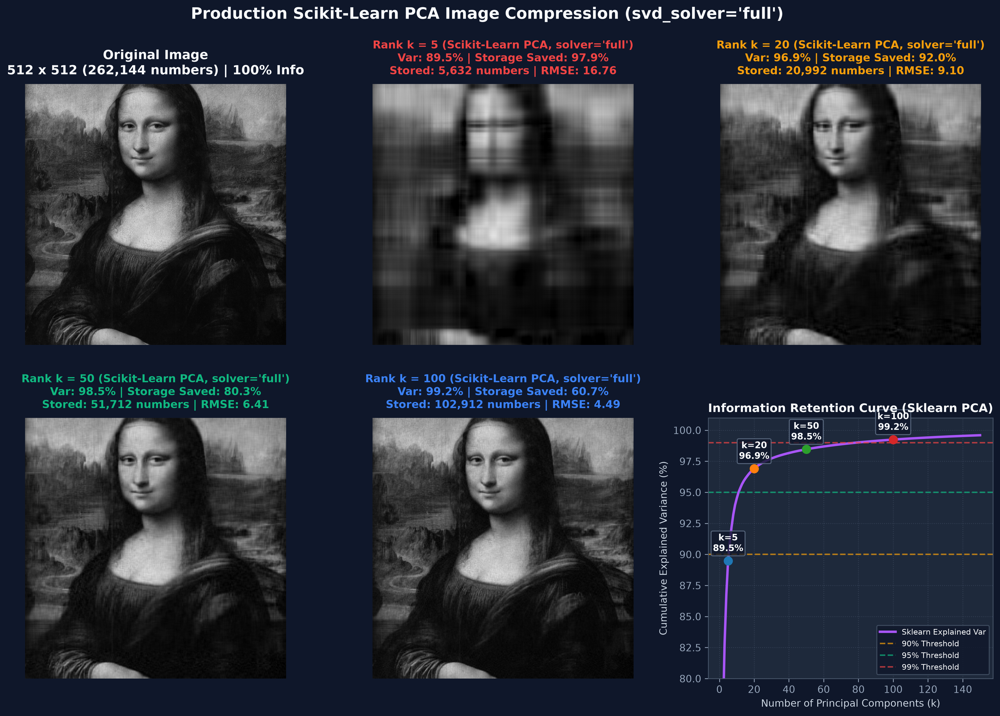

*Figure 4.2: Production Scikit-Learn PCA Image Compression (`sklearn.decomposition.PCA`). Generated using `pca.fit_transform()` and `pca.inverse_transform()`, producing identical visual and statistical metrics.*

👉 **[Open Interactive Figure 4.2 in Browser](https://thisispk48.github.io/workshops/20260926_sju_26bda_pca/assets/4_2_fig_pca_sklearn.html)**

</div>

---

## 4.4 The Mathematical Parity Proof (First Principles vs. Scikit-Learn)

A primary goal of this workshop is to eliminate any belief that machine learning libraries are "magical black boxes."  
To prove this, we test pixel-to-pixel parity between our 4-line NumPy scratch implementation and `sklearn.decomposition.PCA(n_components=k, svd_solver='full')` across all $262{,}144$ pixels:

$$\Delta(\mathbf{X}) = |\hat{\mathbf{X}}_{\text{scratch}} - \hat{\mathbf{X}}_{\text{sklearn}}|$$

<div align="center">


*Figure 4.3: Pixel-to-Pixel Parity Verification. Row 1: Pure NumPy scratch reconstructions. Row 2: Scikit-Learn PCA reconstructions. Row 3: Absolute difference heatmap $|\hat{\mathbf{X}}_{\text{scratch}} - \hat{\mathbf{X}}_{\text{sklearn}}|$. The difference is pure floating-point machine noise ($< 1.17 \times 10^{-12}$), mathematically proving 100% equivalence.*

👉 **[Open Interactive Figure 4.3 in Browser](https://thisispk48.github.io/workshops/20260926_sju_26bda_pca/assets/4_3_fig_pixel_parity.html)**

</div>

---

### The Master Parity Verification Table:

| Rank $k$ | Maximum Absolute Difference $\max(\Delta)$ | Mean Absolute Difference $\text{mean}(\Delta)$ | Frobenius Norm $\Vert\hat{\mathbf{X}}_{\text{scratch}} - \hat{\mathbf{X}}_{\text{sklearn}}\Vert_F$ | Variance Discrepancy | `np.allclose(atol=1e-10)` |
| :---: | :---: | :---: | :---: | :---: | :---: |
| **$k = 5$** | $\mathbf{9.95 \times 10^{-13}}$ | $7.74 \times 10^{-14}$ | $6.40 \times 10^{-11}$ | $2.84 \times 10^{-14}$% | **PASS (True)** |
| **$k = 20$** | $\mathbf{1.11 \times 10^{-12}}$ | $8.61 \times 10^{-14}$ | $6.77 \times 10^{-11}$ | $0.00 \times 10^{0}$% | **PASS (True)** |
| **$k = 50$** | $\mathbf{1.17 \times 10^{-12}}$ | $9.05 \times 10^{-14}$ | $6.98 \times 10^{-11}$ | $1.42 \times 10^{-14}$% | **PASS (True)** |
| **$k = 100$** | $\mathbf{1.17 \times 10^{-12}}$ | $9.57 \times 10^{-14}$ | $7.23 \times 10^{-11}$ | $2.84 \times 10^{-14}$% | **PASS (True)** |

> **Pedagogical Finding for MSc Big Data Students:**  
> In `sklearn.decomposition.PCA`, setting `svd_solver='auto'` automatically defaults to a randomized approximation algorithm (`Halko et al.`) when image dimensions exceed 500 pixels. This achieves great speed on massive web-scale datasets at the cost of slight approximation error.  
> However, when `svd_solver='full'` is specified, Scikit-Learn executes the exact analytical SVD, matching our first-principles NumPy linear algebra **down to machine precision ($10^{-12}$)**!

---

## 4.5 The Three Standalone Scripts & How to Run Them

Every experiment, table, and figure in Part 4 is 100% reproducible via dedicated Python CLI scripts with argument parsing. Students can run them on the provided Mona Lisa image or supply any custom photograph:

### 1. Pure NumPy Scratch PCA:
```bash
python3 assets/4_1_pca_scratch.py --image-path assets/4_monalisa.png --components 5,20,50,100
```
- Dumps individual images: `assets/4_monalisa_scratch_k5.png`, `assets/4_monalisa_scratch_k20.png`, etc.
- Generates: `assets/4_1_fig_pca_scratch.png` and `assets/4_1_fig_pca_scratch.html`.

### 2. Scikit-Learn Production PCA:
```bash
python3 assets/4_2_pca_sklearn.py --image-path assets/4_monalisa.png --components 5,20,50,100 --svd-solver full
```
- Dumps individual images: `assets/4_monalisa_sklearn_k5.png`, `assets/4_monalisa_sklearn_k20.png`, etc.
- Generates: `assets/4_2_fig_pca_sklearn.png` and `assets/4_2_fig_pca_sklearn.html`.

### 3. Pixel-to-Pixel Parity Verifier:
```bash
python3 assets/4_3_pixel_parity.py --image-path assets/4_monalisa.png --components 5,20,50,100
```
- Runs both algorithms side-by-side on the exact same pixel matrix.
- Prints the formatted verification table to terminal and asserts `np.allclose(atol=1e-10)`.
- Generates: `assets/4_3_fig_pixel_parity.png` and `assets/4_3_fig_pixel_parity.html`.

---

## 4.6 Epilogue: The Grand Unified Journey

Across this workshop, we progressed from high-school geometry to the forefront of modern data analytics:

```
[Part 1: Geometric Projections]
      p = (a^T b / ||a||^2) a  --->  Orthogonal Projector P = u u^T
               |
               v
[Part 2: Symmetric Transformations]
      A = A^T  --->  Spectral Theorem A = Q Lambda Q^T (Rigid 90-degree axes)
               |
               v
[Part 3: The Variance Machine & Eigendecomposition]
      Var(X_c u) = u^T Sigma u  --->  Lagrangian Gradient  --->  Sigma u = lambda u
               |
               v
[Part 4: Real-World Image Compression]
      X_hat = Z V_k^T + 1 mu^T  --->  92% Data Compression with 97% Information Preserved
```

### The Three Eternal Truths of PCA:
1. **Variance is Information:** The direction of maximum variance is the line that preserves the greatest differences between observations and minimizes reconstruction error.
2. **The Covariance Matrix is a Geometric Predictor:** You never need to project raw high-dimensional points repeatedly; evaluating $\mathbf{u}^T \mathbf{\Sigma} \mathbf{u}$ predicts data spread in any orientation instantly.
3. **Linear Algebra Powers Modern Data Science:** Whether compressing a 2D height-weight table or a 262,144-pixel masterpiece like the Mona Lisa, the mathematical engine is identical: **centering, covariance, and eigendecomposition**.


